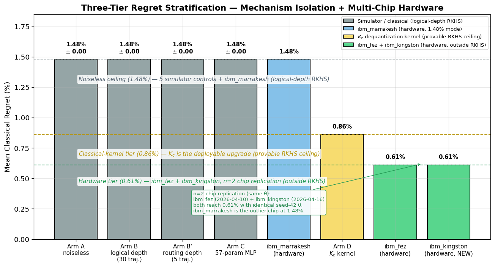
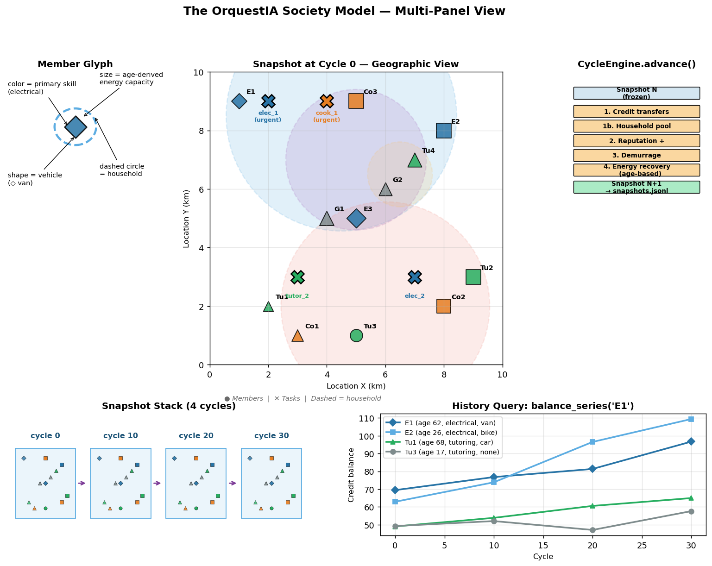

# From Qubits to Communities: Hybrid Quantum Coordination for Future Collective Economies

**Zenodo release package — paper, code, results, and reproducibility instructions.**

**Author:** Ariel J. Sandez
**Release date:** 2026-04-16
**DOI:** *Pending — Zenodo is minting after v1.0.2 release. Check https://zenodo.org/me/uploads for the live record.*



*The paper's headline result: a three-tier regret stratification on 8 benchmark
matching instances with a fixed pretrained θ. Five simulator controls + ibm_marrakesh
hardware collapse onto the 1.48% noiseless ceiling; the Shin–Teo–Jeong classical
kernel $K_c$ reaches 0.86% (provable RKHS ceiling at logical depth); ibm_fez
and ibm_kingston independently reach 0.61% — outside the logical-depth RKHS.*

---

## What's in this package

This is the reproducibility package for the manuscript
*"From Qubits to Communities: Hybrid Quantum Coordination for Future Collective Economies"*
which reports the first multi-chip hardware execution of an end-to-end
quantum-classical coordination pipeline on IBM Heron R2 processors
(ibm_fez, ibm_marrakesh, ibm_kingston, 156 qubits each).

### Headline result

A **three-tier regret stratification** on 8 benchmark matching instances
with a fixed pretrained θ (57 parameters):

| Tier | Regret | Methods |
|------|--------|---------|
| Noiseless ceiling | 1.48% | 5 simulator controls + ibm_marrakesh hardware + parameter-matched MLP + LightGBM + GNN-MLP |
| Classical-kernel tier | 0.86% | Shin–Teo–Jeong dequantization kernel $K_c$ (provable RKHS ceiling at logical depth; deployable today) |
| **Hardware tier** | **0.61%** | **ibm_fez + ibm_kingston** (n=2 chip replication, identical θ, outside the logical-depth RKHS) |

### Package structure

```
zenodo_release/
├── README.md                        ← this file
├── LICENSE                          ← MIT
├── CITATION.cff                     ← structured citation metadata
├── requirements.txt                 ← pinned Python deps
├── MANIFEST.md                      ← file-level inventory
├── paper/
│   ├── paper.md                     ← MAIN manuscript (quantum pipeline paper)
│   ├── orquestia_context_paper.md   ← Parent DCIN paper (OrquestIA v3 unified)
│   ├── SOCIETY_MODEL.md             ← Society model architecture + Tier A features
│   └── figures/                     ← 6 figures + generators
└── code/experiments/                ← mirrors the original repo layout
    ├── core/                        ← v2 domain model (Pydantic) + QUBO + cycle engine
    ├── experiments/                 ← Experiment scripts (exp1–9, paper-cited)
    ├── scripts/                     ← Snapshot + 3 verification scripts
    ├── config/community_economy.json    Community configuration
    ├── activate_gpu.sh              ← Helper: fixes venv_gpu LD_LIBRARY_PATH
    └── results/
        ├── exp6d/hardware_instances_v2.json  ← FROZEN 8 benchmark instances (v2-native)
        ├── exp6d/theta.npy          ← Pretrained θ (57 params, "seed-42 θ")
        ├── exp6d/theta_seed3.npy    ← Regenerated seed-3 θ (kingston validation)
        ├── exp6d/*.json             ← Hardware benchmarks on ibm_fez + ibm_marrakesh
        ├── exp6d_kingston/*.json    ← ibm_kingston with seed-42 θ (0.61% — n=2 replication)
        ├── exp6d_kingston_seed3/*.json  ← ibm_kingston with seed-3 θ (1.48% — within-chip bimodal)
        ├── exp7/*.json              ← Mechanism isolation (Arms A/B/B'/C/D + 30-traj)
        ├── exp7d/multi_seed_theta.json  ← Multi-seed θ training (Phase 2A)
        ├── exp7e/classical_baselines.json   LightGBM + GNN-MLP baselines (Phase 2F)
        ├── exp8/exp8_kernel_qubo.json   ← Kernel-weighted QUBO
        ├── exp9b/factorial.json     ← Society Tier-A factorial ablation (Phase 2B)
        ├── exp9c/bridge.json        ← Quantum+society bridge (Phase 2D)
        ├── exp9d/longitudinal.json  ← 3-year longitudinal sim (Phase 2G)
        ├── exp2e_ltier/exp9_l.json  ← L-tier scaling (Phase 2E)
        └── exp3_n10/exp3_validation.json    Performativity at n=10 runs (Phase 2C)
```



*The OrquestIA society model used for Phase 2 experiments (2B, 2D, 2E, 2G).
**Top-left**: member glyph anatomy — size encodes age-derived energy capacity,
color encodes primary skill, marker shape encodes vehicle type.
**Top-center**: 12 members on a 10×10 km grid with sample tasks.
**Top-right**: the seven-step `CycleEngine.advance()` pipeline.
**Bottom**: snapshots across cycles + a `balance_series('E1')` query showing
individual member credit trajectories. See `paper/SOCIETY_MODEL.md` for the
full Pydantic v2 domain specification.*

### Architecture note: v2 unification + v1-compat bridge

The paper's code uses the **v2 Pydantic domain model** (`core.domain`) as
the canonical data representation. The 8 hardware benchmark instances are
**frozen as a v2-native JSON snapshot** at
`code/experiments/results/exp6d/hardware_instances_v2.json` — no
simulation engine is needed at load time for any paper-cited experiment.

For backward compatibility with the original v1-style experiment scripts
(which reach into v1-specific method names like
`member.get_capability_embedding()`), `core.benchmark_fixtures` exposes
`hardware_instances_v1_compat()` — a bridge that loads the v2 snapshot
and wraps each v2 `Member`/`Task` in a lightweight proxy exposing the v1
attribute surface. Three verification scripts in
`code/experiments/scripts/` prove this bridge produces byte-identical
numerical output compared to the original v1 pipeline:

- `verify_v2_equivalence.py` — matches weights / similarities /
  penalties / optima on all 8 instances
- `verify_bridge_equivalence.py` — matches end-to-end `build_qubo`
  output on all 8 instances
- `verify_hardware_json_equivalence.py` — re-runs the evaluation on the
  saved hardware JSONs (ibm_marrakesh, ibm_kingston seed-42, ibm_kingston
  seed-3) and confirms the recorded regrets are reproduced to machine
  precision

`config/community_economy.json` remains only as a **configuration for
regenerating the snapshot** (via
`code/experiments/scripts/snapshot_hardware_instances.py`) and for
parent-paper generative experiments (Exp 1/2/3/4) that simulate a
community. It is **not** required for any hardware-path experiment.

## How to cite

If you use this code, data, or methodology, please cite:

```
Sandez, A. J. (2026). From Qubits to Communities: Hybrid Quantum Coordination
for Future Collective Economies. Zenodo. DOI: <assigned on publication>
```

BibTeX in `CITATION.cff` (auto-renderable by GitHub and many publishers).

## How to reproduce

All commands below assume you are at the `zenodo_release/` root.

### 1. Environment

```bash
python -m venv venv_gpu
source venv_gpu/bin/activate
pip install -r requirements.txt
```

For hardware runs on IBM Quantum, also set up credentials (see
[qiskit-ibm-runtime docs](https://docs.quantum.ibm.com/api/qiskit-ibm-runtime)).

### 2. Pre-trained θ

The headline result uses `code/experiments/results/exp6d/theta.npy`
(57 parameters, SPSA-trained, originally produced by Exp 6d). A companion
θ `theta_seed3.npy` was trained fresh for the ibm_kingston validation.

### 3. Verify the package first (~30 s, CPU-only, recommended)

These three scripts confirm the v2 unification is numerically lossless vs
the original v1 pipeline:

```bash
cd code/experiments

# v1 and v2 produce byte-identical weights / QUBO / optima on all 8 instances
python scripts/verify_v2_equivalence.py

# The v1-compat bridge is drop-in for all existing experiment scripts
python scripts/verify_bridge_equivalence.py

# Replay saved hardware JSONs through the v2 pipeline — regrets match exactly
python scripts/verify_hardware_json_equivalence.py
```

### 4. Run classical-only experiments (minutes, CPU-only)

```bash
cd code/experiments

# Mechanism isolation Arms A, C, D (noiseless sim + classical MLP + K_c kernel)
python experiments/exp7_mechanism_isolation.py --skip-b --spsa-iter 150

# Modern classical baselines: LightGBM + bipartite-GNN-MLP
python experiments/exp7e_classical_baselines.py --models lgbm gnn kc18

# Society-model factorial ablation (Phase 2B)
python experiments/exp9b_factorial_ablation.py --workers 4

# Longitudinal society simulation (Phase 2G, 3 simulated years)
python experiments/exp9d_longitudinal.py --cycles 180 --tier m

# L-tier scaling (Phase 2E, 50 members × 25 tasks)
python experiments/exp2e_ltier_comparison.py --days 30

# Performativity at n=10 (Phase 2C, 500 members × 1000 cycles, ~2 h on 30 cores)
python experiments/exp3b_n10_runner.py
```

### 5. Run the hardware pipeline (needs IBM Quantum credentials)

```bash
cd code/experiments
source activate_gpu.sh   # fixes CUDA LD_LIBRARY_PATH

# Reproduce the seed-42 θ on three chips:
python experiments/exp6d_v3_extended.py --backend ibm_marrakesh --theta-path results/exp6d/theta.npy
python experiments/exp6d_v3_extended.py --backend ibm_fez       --theta-path results/exp6d/theta.npy
python experiments/exp6d_v3_extended.py --backend ibm_kingston  --theta-path results/exp6d/theta.npy

# Control: seed-3 θ on ibm_kingston (should reproduce ~1.48%)
python experiments/exp6d_v3_extended.py --backend ibm_kingston  --theta-path results/exp6d/theta_seed3.npy
```

Each hardware submission is one batched job at 4096 shots × 8 matching
instances × ~12 pairs each; runtime ~90 seconds on Heron R2.

### 6. Regenerate figures

```bash
cd paper/figures
python generate_figures.py
```

All figures regenerate deterministically from the committed JSONs.

### 7. (Optional) Regenerate the instance snapshot

If you want to re-derive the frozen snapshot from the v1 simulation:

```bash
cd code/experiments
python scripts/snapshot_hardware_instances.py
```

This runs the v1 simulation at seed=42, harvests the same 8 instances
(cycles 50, 100, 150, 200, 250, 300, 350, 400, 450, 499), and writes
`results/exp6d/hardware_instances_v2.json`. All paper-cited experiments
then load from this snapshot via `hardware_instances_v1_compat()` — no
direct v1-simulation dependency at runtime.

## Key experimental design notes

- **n=2 hardware chip replication**: the 0.61% hardware tier is observed
  on ibm_fez (2026-04-10) and ibm_kingston (2026-04-16) with identical
  seed-42 θ on different dates. ibm_marrakesh with the same θ produces
  1.48%, revealing chip-calibration sensitivity.
- **Noiseless mechanism isolation**: 30 MC trajectories of calibrated
  ibm_fez NoiseModel + 5 trajectories of routing-depth depolarizing noise
  + 57-parameter MLP + LightGBM + GNN-MLP all produce 1.48% with zero
  variance for the seed-42 θ. The 0.61% is outside every simulator-based
  distribution we can generate.
- **Shin–Teo–Jeong kernel (K_c)**: reaches 0.86%, the provable RKHS
  ceiling at logical depth. The hardware tier at 0.61% is below this
  ceiling, so hardware accesses a function outside the logical-depth
  function class.
- **Multi-seed θ bimodal (Phase 2A)**: 10 independent SPSA training seeds
  on the noiseless simulator produce 8/10 at 1.48% and 2/10 at 0.61%.
  This is a *separate* phenomenon from the hardware tier — it's across
  different trained θ on a single simulator, whereas the hardware tier
  is a fixed-θ, chip-varying observation.

## Open questions / future work

- **Multi-θ × multi-chip characterization**: 5 independently trained θ
  × 3 chips = 15 hardware jobs. Would resolve which θ unlock the 0.61%
  regime on which chips and whether ibm_marrakesh ever enters 0.61% mode.
- **Mechanism for ibm_marrakesh outlier**: not characterized. Candidates:
  coherence profile differences, non-Markovian noise spectrum, native-gate
  orientation on the heavy-hex lattice, or transpile-preset sensitivity.
- **Error-mitigated QAOA for direct QUBO**: the paper's Stage 3 (direct
  QUBO) currently collapses at p=3 on hardware. Dynamical decoupling +
  gate twirling may shift the depth threshold.
- **Empirical calibration of the society model**: the pipeline's Phase 2
  results on the Pydantic society model are not empirically calibrated
  against a real community. A neighborhood-scale pilot is under discussion.

## Software notes

- Python 3.12, qiskit 1.4.5 + qiskit-aer-gpu 0.15.1 + qiskit-ibm-runtime 0.40.1
- GPU needed for 30-trajectory noisy-simulator runs (Arm B).
- `code/experiments/activate_gpu.sh` fixes a cusparse / nvjitlink symbol-shadowing
  issue between venv-bundled CUDA libs and system `/usr/local/cuda-12.8`.

## License

MIT (see `LICENSE`).

## Contact

**Ariel J. Sandez** — Independent Researcher

- Email: [asandez@gmail.com](mailto:asandez@gmail.com) *(preferred)*
- ORCID: [0009-0004-7623-6287](https://orcid.org/0009-0004-7623-6287)
- LinkedIn: [linkedin.com/in/sandez](https://www.linkedin.com/in/sandez/)
- X / Twitter: [@sandezariel](https://x.com/sandezariel)

For questions about this package, reproducibility issues, or collaboration
inquiries, email is the preferred channel.
