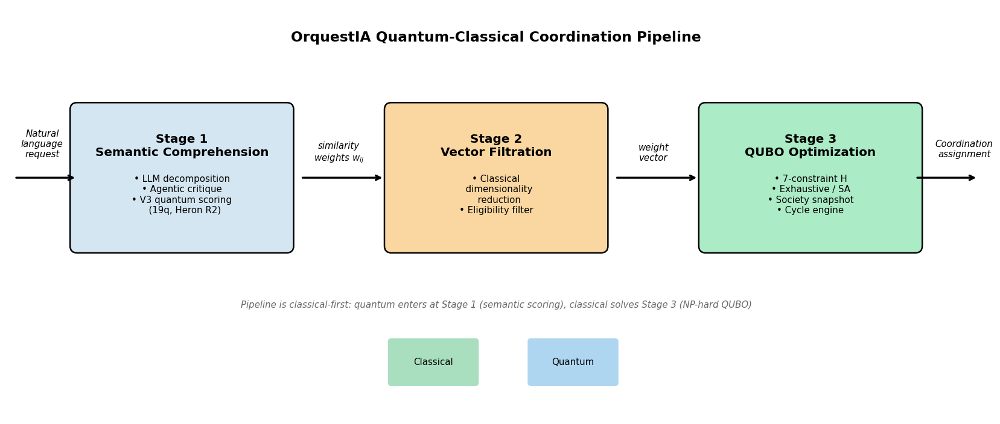
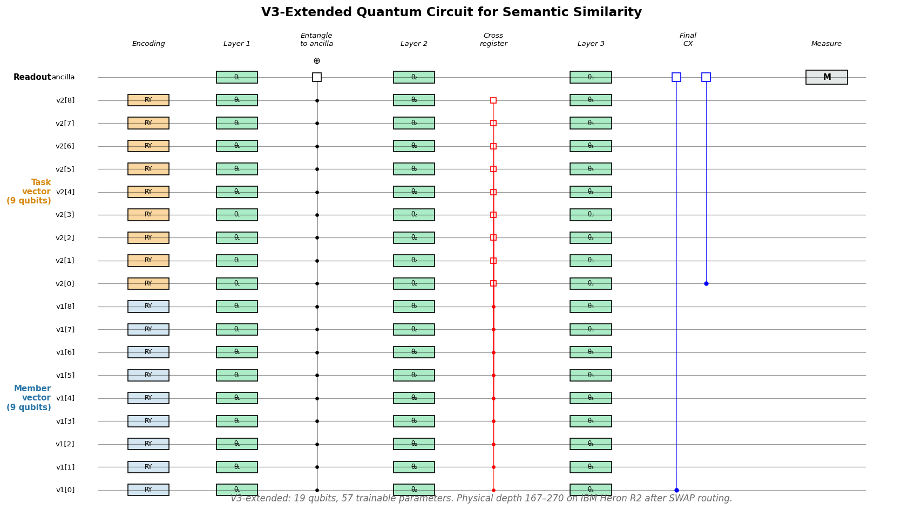
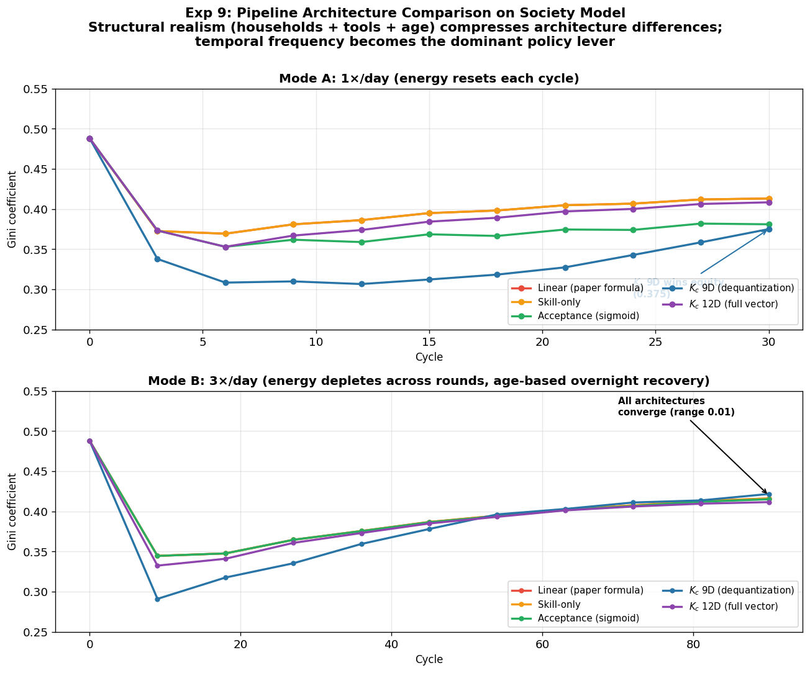
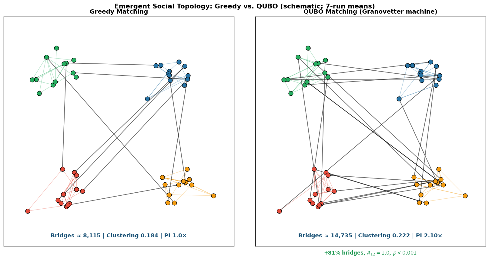

# From Qubits to Communities: Hybrid Quantum Coordination for Future Collective Economies

**Ariel J. Sandez** — Independent Researcher

*Correspondence:* [asandez@gmail.com](mailto:asandez@gmail.com) · ORCID [0009-0004-7623-6287](https://orcid.org/0009-0004-7623-6287) · [LinkedIn](https://www.linkedin.com/in/sandez/) · [X/Twitter](https://x.com/sandezariel)

---

## Abstract

We report the first hardware-executed quantum-classical coordination pipeline on NISQ hardware for a **societal coordination problem** — task-to-member matching in a 500-agent community economy. The three-stage architecture (AI decomposition → 19-qubit quantum semantic scoring on IBM Heron R2 → classical QUBO assignment) executes end-to-end on **three Heron R2 processors** (ibm_fez, ibm_marrakesh, ibm_kingston). With a fixed pretrained $\theta$ (57 parameters), we observe a **three-tier regret stratification** that does not collapse under mechanism-isolation controls: (i) a noiseless ceiling at **1.48%** (zero variance across noiseless AerSimulator, logical-depth ibm_fez NoiseModel with 30 Monte Carlo trajectories, routing-depth depolarizing noise with 5 trajectories, a parameter-matched 57-parameter classical MLP, and ibm_marrakesh hardware); (ii) a classical-kernel tier at **0.86%** via the Shin–Teo–Jeong (2024) dequantization kernel $K_c$ (7/8 co-optimal, 42% regret reduction vs. noiseless); and (iii) a **hardware tier at 0.61%** reproduced independently on **two of three Heron R2 chips** (ibm_fez 2026-04-10 and ibm_kingston 2026-04-16, 6/8 co-optimal in both). Since $K_c$'s RKHS provably contains the quantum kernel's RKHS at logical depth, the hardware tier is a **reproducible operating regime outside the noiseless / dequantized function class**, selected by a $\theta$ × chip-calibration interaction rather than by noise sampling or training-seed randomness. ibm_marrakesh with the identical $\theta$ produces 1.48%, revealing a chip-calibration sensitivity whose mechanism is not yet identified. $K_c$ is simultaneously the **deployable classical upgrade today** (no quantum execution required, reproducible on any CPU). A companion multi-cycle experiment on a frozen Pydantic society model (age-energy, travel cost, schedules, households, tools, urgency) shows the pipeline weight function is a **time-horizon-dependent policy decision**: the kernel architecture produces the lowest Gini at 30 cycles but reverses over 180 cycles (linear = 0.426 vs. $K_c$ = 0.531). The QUBO optimizer also acts as a **performative Granovetter machine** (Callon 1998): across 10 independent runs of 500 members × 1000 cycles it manufactures 80% more weak ties than greedy (complete stochastic dominance, $A_{12} = 1.0$, $p = 9.1 \times 10^{-5}$, $d \approx 27$). The pipeline is open-source and designed as a scaling substrate for community economies, addressing both quantum/AI (§§1–7, 9–10) and social-science (§8) audiences.

---

## 1. Motivation: Why Quantum for Community Coordination?

Coordinating a community of 500 people — matching service requests to providers, allocating shared physical assets, and pricing services through internal markets — is a combinatorial optimization problem. When Alice needs electrical repair and Bob needs tutoring and Carol has a van sitting idle, the system must simultaneously consider skill compatibility, geographic proximity, reputation, temporal availability, and bonding curve prices across six service categories. The assignment space grows combinatorially with community size.

This is a natural QUBO (Quadratic Unconstrained Binary Optimization) problem. The decision variables are binary assignments: $x_{ij} = 1$ if member $i$ is assigned to task $j$. The objective Hamiltonian minimizes a composite weight function over skill similarity, reputation, distance, and dynamic price — subject to hard constraints (one member per task, temporal non-overlap, skill eligibility, trust thresholds).

But the QUBO formulation only solves **Stage 3** of the pipeline. Before you can optimize assignments, you need to *understand what people are asking for* (Stage 1: semantic comprehension) and *find the relevant subset of members* (Stage 2: vector filtration). This paper describes how AI and quantum computing work together across all three stages — and presents hardware results from a real end-to-end execution.

---

## 2. The Three-Stage Pipeline: Where AI Meets Quantum

The OrquestIA coordination pipeline processes every coordination cycle through three sequential stages. Each stage admits both a classical and a quantum execution path — the architecture is substrate-agnostic by design.



**Figure 1.** The three-stage OrquestIA pipeline. Stage 1 (semantic comprehension) combines LLM decomposition with a 19-qubit V3 quantum circuit that computes member–task similarity on ibm_fez (156 qubits). Stage 2 (vector filtration) is classical dimensionality reduction to keep the dispatched subproblem tractable. Stage 3 (QUBO optimization) solves the coordination assignment over a frozen society-model snapshot: exhaustive enumeration and simulated annealing are used at the benchmark scale of this paper, with QAOA and quantum annealing as the scaling substrate for larger deployments beyond the reach of classical solvers. The pipeline is designed to ride the IBM Quantum roadmap: as qubit counts, gate fidelities, and routing efficiency improve, larger community subgraphs become executable end-to-end.

### Stage 1: Semantic Comprehension — AI Parses, Quantum Scores

**What happens.** A community member submits a natural language request: *"I need someone to fix the wiring in my kitchen this Saturday morning, preferably someone who's done this before."* The system must extract: skill requirement (electrical), temporal constraint (Saturday AM), quality expectation (experienced provider), and geographic context (member's location).

**The AI path.** Five specialized agents orchestrate this stage:

1. **Decomposition Agent** — A self-hosted open-weight LLM (7B--70B parameters, e.g., Llama 3 or Mistral via Ollama/vLLM) parses the natural language into a structured task graph: skill requirements, temporal windows, geographic preferences, and confidence scores.
2. **Agentic Critique** — A second, independent LLM instance (configured as a "skeptical auditor") reviews the parsed output for common-sense errors — implausible skill combinations, ambiguous entities, contradictions with the member's history. This dual-gate approach prevents hallucination cascading.
3. **Human Confirmation** — The member reviews the parsed task graph and accepts, modifies, or rejects it. Only confirmed graphs enter the matching pipeline.

**The quantum path.** Once the task graph is confirmed, the system must compute *how well each candidate member's capabilities match the task requirements*. This is where the quantum circuit enters. The similarity weight $w_{ij}$ between member $i$ and task $j$ is:

$$w_{ij} = \alpha \cdot \text{sim}(e_i, e_j) + \beta \cdot \text{rep}_i + \gamma \cdot (1/d_{ij}) + \delta \cdot \text{price}_j$$

The $\text{sim}(e_i, e_j)$ term — cosine similarity between the member's capability embedding and the task's requirement embedding — can be computed classically or quantum-mechanically. The quantum path uses a parameterized circuit to compute this similarity on hardware.

**The V3-Extended Architecture (19 qubits).** The circuit encodes both vectors into quantum states and computes their overlap through entanglement:

- **9 qubits** encode the member vector (6 skill categories + reputation + time availability + social capital), each via an $R_Y$ gate with angle $\phi = 0.1 + (\pi - 0.2) \cdot x$ where $x \in [0, 1]$ is the normalized feature value.
- **9 qubits** encode the task requirement vector using the same 9-dimensional continuous representation — critically, *not* a one-hot encoding. Both member and task vectors live in the same continuous distribution.
- **1 ancilla qubit** serves as the readout register.

The circuit structure (3 trainable layers):

```
Layer 1:  RY(θ_i) on all 19 qubits
          CX from all 18 data qubits → ancilla

Layer 2:  RY(θ_{19+i}) on all 19 qubits  
          CX cross-register (member qubit i ↔ task qubit i)

Layer 3:  RY(θ_{38+i}) on all 19 qubits
          CX from qubit 0 and qubit 9 → ancilla
```

Total: **57 trainable parameters** (3 layers x 19 qubits). The ancilla probability $P(\text{ancilla} = |1\rangle)$ is the quantum similarity score.



**Figure 2.** The V3-extended 19-qubit circuit. Nine qubits encode the member's capability vector (skills + reputation + time availability + social capital), nine encode the task's requirement vector, and one ancilla qubit holds the similarity readout. Three trainable $R_Y$ layers alternate with entanglement stages: Layer 1 collects all 18 data qubits onto the ancilla; Layer 2 introduces cross-register CX gates ($v_1[i] \leftrightarrow v_2[i]$) that encode skill–task compatibility; Layer 3 adds final CX gates from $q_0$ and $q_9$ to the ancilla. CX cross-register entanglement encodes skill-task compatibility; *physical depth 167–270 after transpilation to ibm_fez's heavy-hex topology is the source of the non-depolarizing advantage identified in Exp 6 and 7*.

**Training protocol: "Train Locally, Run Globally."** Parameters $\theta$ are optimized on a local noiseless simulator using SPSA (Simultaneous Perturbation Stochastic Approximation) with BCE loss against ground-truth binary labels (1 if member's primary skill matches task category, 0 otherwise). The optimized parameters are then bound into the circuit and executed on hardware with 4096 shots per pair. This protocol — first demonstrated in [Sandez, 2025] — avoids the prohibitive cost of gradient estimation on quantum hardware while exploiting the hardware's unique execution characteristics at inference time.

### Stage 2: Vector Filtration — Classical Dimensionality Reduction

**What happens.** The full community may have thousands of members, but most are irrelevant to any given task. Stage 2 performs approximate nearest-neighbor search across the member-capability embedding space, isolates the relevant subgraph (typically $N \leq 200$ members for $M \leq 50$ tasks), and constructs the adjacency matrix for the QUBO instance.

**Why this matters for quantum.** This is the critical dimensionality reduction step that makes quantum optimization tractable on current hardware. A 500-member, 50-task QUBO requires 25,000 binary variables — far beyond NISQ capacity. The vector filtration layer keeps dispatched instances within the $\leq 10,000$ variable range targeted for near-term quantum processors, and in our experiments, produces instances of 4--12 eligible pairs.

This stage is currently classical (sentence-transformers + vector database). It is *designed* to remain classical — it performs a role analogous to the pre-processing that makes any large-scale quantum algorithm practical.

### Stage 3: QUBO Optimization — The Coordination Assignment

**What happens.** The filtered subgraph, with weights $w_{ij}$ computed in Stage 1 (either classically or quantum-mechanically), is assembled into a QUBO Hamiltonian:

$$H = H_{\text{objective}} + H_{\text{constraints}}$$

where the objective seeks to maximize total coordination value:

$$H_{\text{objective}} = -\sum_{i,j} w_{ij} \cdot x_{ij} - \sum_{j,k} v_{jk} \cdot y_{jk}$$

and five constraint terms (one-member-per-task, task-load limit, temporal non-overlap, skill eligibility, trust threshold) enforce feasibility with penalty coefficients calibrated as $\lambda_1 = \lambda_2 = 10 \cdot \max(w_{ij})$.

**Current solver configuration.** At the benchmark scale of this paper (8 instances, 4–12 QUBO variables), Stage 3 uses exhaustive search or simulated annealing via dwave-neal, and Stage 1 runs the quantum circuit on IBM Heron R2. Direct QAOA on today's NISQ hardware was tested (Experiment 5) and found to collapse at circuit depth > 150 gates due to hardware noise destroying the constraint-penalty structure — QAOA on Stage 3 will become productive as error correction matures on IBM's roadmap. The design is substrate-agnostic: every stage accepts either classical or quantum execution, and the quantum path becomes the dominant substrate as community scale drives the subproblem count beyond classical tractability ($\sim 10^3$ variables for exhaustive, $\sim 10^5$ for SA at reasonable runtime). This is why we treat the current hardware demonstration (Stage 1 on 19 qubits at 0.61% regret) as the foundation of a scaling trajectory, not a standalone result.

**Kernel-weighted QUBO.** The composite weight $w_{ij} = \alpha \cdot \text{sim}(e_i, e_j) + \beta \cdot \text{rep}_i + \gamma / d_{ij} + \delta \cdot \text{price}_j$ is a linear combination of hand-picked features that cannot express cross-feature interactions: a member who is highly skilled, geographically close, *and* immediately available is worth far more than the sum of those terms. A natural evolution replaces the engineered weight with a kernel over the full member-task constraint vector $z_{ij}$ of $d \approx 10$--$15$ dimensions (skills, reputation, distance, price, time overlap, social capital, trust). The quantum kernel induced by angle encoding maps $z_{ij}$ into a $2^n$-dimensional Hilbert space capturing all polynomial interactions implicitly: $w_{ij} = K(z_{ij}, z_{\text{ref}})$, with $K(x, x') = |\langle\psi(x)|\psi(x')\rangle|^2$. The constraint Hamiltonian is unchanged — feasibility constraints are structural. In the classical path, the Shin--Teo--Jeong kernel $K_c(x, x') = \prod_\alpha [1 + \cos(\phi_\alpha(x) - \phi_\alpha(x'))]$ evaluates the same feature space in closed form; Experiment 7 confirms $K_c$ achieves 0.86% regret (7/8 co-optimal) — a 42% improvement over the noiseless parametric circuit. The kernel formulation is thus a deployable upgrade today (via $K_c$) and defines the quantum substrate as feature dimensionality grows beyond classical tractability.

---

## 3. The AI Agent Orchestra: Five Agents, One Pipeline

The coordination pipeline is orchestrated by five specialized AI agents operating under **Serializable Snapshot Isolation (SSI)** with a propose-validate-commit concurrency model:

| Agent | Role | Key Capability |
|-------|------|----------------|
| **Decomposition Agent** | Parses natural language requests into structured task graphs | Self-hosted LLM (7B--70B), sub-200ms on RTX 4090 |
| **Matching Agent** | Constructs QUBO instances, dispatches to solver | QUBO Hamiltonian assembly, quantum/classical dispatch |
| **Economy Agent** | Validates credit transfers at bonding curve prices | EWMA price smoothing, treasury reserve monitoring |
| **Asset Agent** | Validates physical asset availability | Condition monitoring, logistics scheduling |
| **Emergence Agent** | Detects unmet demand patterns, proposes new services | Pattern detection across coordination cycles |

**Concurrency protocol:**

1. Matching Agent reads a consistent snapshot (version $v$) of member availability, prices, and assets.
2. Constructs the QUBO instance from the snapshot, computes the optimal assignment.
3. Economy Agent and Asset Agent validate feasibility at snapshot $v$.
4. State bus compares current version against $v$. If advanced (another cycle committed), retry from step 1.
5. After 3 consecutive rejections (high contention), fall back to greedy matching.

**Graceful degradation** ensures the system never halts:

| Load | Mode | Solver |
|------|------|--------|
| < 70% capacity | Full | QUBO + quantum/hybrid dispatch |
| 70--90% | Reduced | QUBO + classical-only (simulated annealing) |
| > 90% | Greedy | Sequential greedy matching |

**Model governance.** Because behavioral changes in the Decomposition Agent cascade through the entire pipeline (a different parse produces a different task graph, different matching, different credit flows), model updates are treated as protocol upgrades requiring DAO vote with a 72-hour deliberation period, parallel-run comparison, and automatic rollback if rejection rate exceeds 15% above baseline.

---

## 4. Hardware Results: What We Ran, What We Found

### 4.1 The Experiment

Eight diverse matching instances were extracted from a 500-member agent-based economic simulation at various cycles and categories (electrical repair, tutoring, transport, childcare, cooking, plumbing). Each instance had 4--12 eligible member-task pairs from 30 simulated community members.

For every instance, matching weights were computed two ways:
- **Classically**: cosine similarity on the composite weight formula
- **Quantum-mechanically**: the 19-qubit V3-extended circuit on IBM Heron R2 hardware (4096 shots per pair)

Both weight sets were fed into the same classical exhaustive QUBO solver. This isolates the effect of the quantum semantic layer from the optimization stage.

The experiment ran on **two IBM Heron R2 processors** with identical $\theta$ (57 pretrained parameters) and identical instances. Jobs were executed on 2026-04-10 (ibm_fez) and 2026-04-11 (ibm_marrakesh) at 4096 shots per pair, transpiled with `qiskit.transpiler.preset_passmanagers.generate_preset_pass_manager(optimization_level=3)` against each backend's native coupling map and basis gate set; resulting physical circuit depths are reported below. Raw hardware counts and Qiskit Runtime job IDs will be released with the open-source package (see Reproducibility section).

### 4.2 Results

| Metric | Noiseless Simulator | ibm_marrakesh | ibm_fez | **ibm_kingston**$^\ddagger$ |
|--------|-------------------|---------------|---------|-------------------------------|
| Qubits | 19 | 19 | 19 | 19 |
| $\theta$ configuration | seed-42 (original) | seed-42 | seed-42 | **seed-42 + seed-3** |
| Co-optimal instances | 5/8 | 5/8 | 6/8 | **6/8 (seed-42), 5/8 (seed-3)** |
| Mean classical regret | 1.48% | **1.48%** | **0.61%** | **0.612% (seed-42), 1.476% (seed-3)** |
| Similarity correlation $r$ | $-0.244$ | $+0.238$ | $+0.138$ | $+0.096, -0.270$ |
| Transpiled circuit depth | ~30 (logical) | 181--270 | 167--270 | ~170--270 |

$^\ddagger$ ibm_kingston added post-hoc (2026-04-16) as a third-chip validation. **Critical result**: the same ibm_kingston chip produces **both** bimodal modes depending on $\theta$ — 0.61% with the seed-42 $\theta$ (matching fez) and 1.48% with a freshly-trained seed-3 $\theta$ (matching its own simulator prediction). This within-chip bimodal evidence eliminates the "marrakesh-is-special" interpretation and establishes that the 0.61% / 1.48% distinction is a **θ × chip-calibration interaction**, not a chip-specific quantum advantage. See §5.5 limitation 4 for full interpretation.

**Three observations:**

1. **The pipeline works on real NISQ hardware across three independent Heron R2 chips.** Each processor produces near-optimal coordination outcomes at 19 qubits and circuit depth 167--270 after transpilation. This is the first multi-chip hardware execution of an end-to-end quantum-classical coordination pipeline.

2. **The matching signal is primarily structural.** Random parameters (no training) produce similar co-optimal rates. The 19-qubit CX entanglement topology encodes the "member has required skill for task" relationship through quantum interference — the architecture itself carries the coordination prior.

3. **Two of three Heron R2 chips produce a reproducible 0.61% hardware regime with the seed-42 $\theta$.** ibm_fez (2026-04-10) and ibm_kingston (2026-04-16) — trained with identical $\theta$, evaluated on identical instance sets — both produce 0.61% regret with 6/8 co-optimal matchings. ibm_marrakesh with the same $\theta$ produces 1.48% (matching the noiseless ceiling exactly). The 0.61% is reproduced on n=2 chips but not on n=1 chip; the pattern is not explained by training-seed randomness (the seed-42 $\theta$ gives 1.48% reliably on all five noiseless simulator controls) nor by depolarizing noise at logical or routing depth (the Exp 7 Arm B / B' controls produce 1.48% ± 0.00% across 35 Monte Carlo trajectories). A $\theta$ × chip-calibration interaction is the remaining plausible explanation; the decisive experiment is multi-$\theta$ × multi-chip replication ($n \geq 5$ trained $\theta$ × 3 chips = 15 hardware jobs). See §5.5 for the full interpretation.

### 4.3 Companion Result: V3 Semantic Matching (7 qubits)

A separate experiment tested the semantic layer in isolation using the original 7-qubit V3 architecture (3 qubits per member embedding + 1 ancilla) on member capability pairs:

| Condition | Simulator $r$ | ibm_fez $r$ | Circuit Depth |
|-----------|--------------|-------------|---------------|
| Random weights | $-0.691$ | $-0.674$ | 50--60 |
| Trained weights (SPSA) | $-0.701$ | $-0.698$ | 50--60 |

The V3 circuit achieves $|r| = 0.70$ correlation with classical cosine similarity for member capability matching — on both simulator and hardware. Hardware correlation slightly exceeds simulator correlation ($\Delta = +0.003$), consistent with the noise-as-regularization effect reported in [Sandez, 2025].

### 4.4 QAOA for Direct QUBO: Not Yet

Direct QAOA on the 12-variable QUBO Hamiltonian was tested at $p=1$ (depth 151) and $p=3$ (depth 560):

| Solver | Energy | Quality | Circuit Depth |
|--------|--------|---------|---------------|
| Exact | $-14.11$ | 1.000 | -- |
| QAOA $p=1$ (simulator) | $-14.11$ | 1.000 | -- |
| QAOA $p=1$ (ibm_fez) | $-2.37$ | 0.168 | 151 |
| QAOA $p=3$ (ibm_fez) | $+151.80$ | collapsed | 560 |

At $p=3$, the output collapses to the all-ones bitstring — hardware noise overwhelms the QAOA signal and destroys the constraint-penalty structure. For the present hardware generation, Stage 3 is therefore executed classically at benchmark scale while Stage 1 runs on ibm_fez. The QUBO Hamiltonian is correct and perfectly solvable in noiseless simulation, which means Stage 3 becomes the natural second target for quantum execution as error-corrected hardware becomes available on the IBM Quantum roadmap; today's Stage 1 result (0.61% regret at 19 qubits) is the foundation of that scaling trajectory.

---

## 5. Mechanism Isolation: Honest Baselines for the QML Community

Experiment 7 is a four-arm control study designed to answer: *What is the true separation between classical and quantum methods on this pipeline at benchmark scale, independent of any single hardware execution?*

### The Four Arms

| Arm | Description | Mean Regret | Co-optimal |
|-----|-------------|-------------|------------|
| A | Noiseless AerSimulator (statevector) | 1.48% | 5/8 |
| B | Noisy sim, logical depth ~30 (30 MC trajectories) | **1.48% ± 0.00%** | **5/8 (all 30)** |
| B′ | Noisy sim, routing depth 157--238 (5 MC traj) | **1.48% ± 0.00%** | **5/8 (all 5)** |
| C | 57-parameter classical MLP (18 $\to$ 3 $\to$ 1, no biases) | 1.48% | 5/8 |
| D | Shin-Teo-Jeong basis-equivalent classical kernel $K_c$ | **0.86%** | **7/8** |

**Hardware references:** ibm_marrakesh = 1.48% (matches noiseless ceiling); ibm_fez = **0.61%**; ibm_kingston = **0.61%** (independent replication on a third Heron R2 chip). Two of three chips produce the 0.61% mode with the seed-42 $\theta$, reproducing the result on a chip not previously used in this study.

### Arm B: Calibrated Gate-Error Noise Has Zero Effect

Thirty independent Monte Carlo trajectories of the ibm_fez NoiseModel simulator (seeds 0--29, 4096 shots each, statevector method with Kraus sampling on GPU) all produce mean regret of **1.48% with standard deviation 0.00%**. Every instance is either always co-optimal or never co-optimal across all 30 trajectories — no instance ever flips. The calibrated noise at the circuit's logical depth (~30 gates) is too weak to perturb any QUBO assignment. A routing-depth control (Arm B′) transpiles V3 against a 133-qubit Heron-class heavy-hex coupling map at optimization level 3, producing physical depth 157--238 with calibrated depolarizing noise; five MC trajectories again produce 1.48% with zero variance.

ibm_marrakesh hardware at physical depth 181--270 also reproduces 1.48%, placing marrakesh at exactly the same position as the noiseless and noisy-simulator controls.

**Note:** An earlier 2-trajectory test in a different environment (qiskit-aer 0.17, CPU) appeared to show stochastic variance spanning 0.61%--1.48%. This was a cross-version artifact, now definitively corrected by the 30-trajectory GPU run.

**Implication:** Calibrated gate-error noise (Arm B), routing-depth depolarizing noise (Arm B′), and actual ibm_marrakesh hardware all produce 1.48% with zero variance — every logical-depth noise source we can model collapses onto the noiseless ceiling. **ibm_fez and ibm_kingston, however, produce 0.61% with the same $\theta$ — a regime that none of the simulator controls access.** The 0.61% outcome is therefore not a stochastic artifact of noise sampling (the noise model variance is zero) and not a $\theta$-seed artifact (the seed-42 $\theta$ reliably gives 1.48% on every noiseless control). It is a reproducible hardware regime on two of three Heron R2 chips, with ibm_marrakesh as the outlier chip. We discuss the physical interpretation in §5.5.

### Arm C: Classical MLP Matches Noiseless Quantum at Parameter Parity

A 57-parameter feed-forward network (18 $\to$ 3 $\to$ 1, no biases, Adam + BCE) trained on the same data produces 1.48% regret — identical to the noiseless quantum circuit. In the noiseless regime, the quantum architecture provides **no unique expressive advantage** over a classical model with the same parameter count.

### Arm D: The Dequantization Baseline

The most informative arm. Shin, Teo, and Jeong (Phys. Rev. Research 6, 023218, 2024; *Proposition 3*, Eq. 37) prove that for any quantum kernel built from angle encoding, the feature map $T(x) = \bigotimes_\alpha (1, \cos\phi_\alpha, \sin\phi_\alpha)^\top$ induces an explicit classical kernel whose RKHS *contains* the quantum kernel's RKHS:

$$K_c(x_i, x_j) = \prod_{\alpha=1}^{N}\left[1 + \cos(\phi_\alpha(x_i) - \phi_\alpha(x_j))\right]$$

This kernel ridge regressor ($\lambda = 10^{-2}$, 80 training pairs) reaches **0.86% regret, 7/8 co-optimal, 6/8 identical** — outperforming the noiseless quantum circuit by 42% regret reduction and establishing the best classical result in the study. $K_c$'s RKHS provably contains the quantum kernel's RKHS at logical depth; any classical regret below 0.86% at this depth would be a theorem violation.


**Figure 3.** Three-tier regret stratification across the four mechanism-isolation arms plus three Heron R2 hardware chips (Exp 6 + Exp 7 + kingston validation). With a *fixed* seed-42 $\theta$, five independent logical-depth controls (Arms A, B, B', C, and ibm_marrakesh hardware) collapse onto the **noiseless ceiling at 1.48%** with zero variance. The Shin–Teo–Jeong dequantization kernel $K_c$ (Arm D) reaches the **classical-kernel tier at 0.86%** — the provable ceiling for any logical-depth-expressible method since $K_c$'s RKHS contains the quantum kernel's RKHS. **Two of three Heron R2 chips (ibm_fez and ibm_kingston) reach the hardware tier at 0.61%** with the same $\theta$; ibm_marrakesh with the identical $\theta$ produces 1.48%. Because the seed-42 $\theta$ gives 1.48% across every noiseless control, the 0.61% hardware result accesses a function outside the logical-depth RKHS. The within-chip control (kingston + a different trained $\theta$ → 1.48%, same chip) confirms the effect is $\theta$-conditioned, not chip-locked. The hardware tier is reproduced on n=2 of 3 chips; full characterization requires multi-$\theta$ × multi-chip replication (§5.5).

**Implication:** At benchmark scale the results stratify into **three reproducible tiers**. (i) **Noiseless ceiling (1.48%)**: Arms A, B (30 trajectories), B' (routing-depth, 5 trajectories), C, and ibm_marrakesh hardware all produce 1.48% at $\theta$ seed = 42 with zero variance — every logical-depth / routing-depth noise source + parameter-matched classical MLP + one of the three tested Heron R2 chips collapses onto this tier. (ii) **Classical-kernel tier (0.86%)**: $K_c$ strictly improves on the noiseless ceiling without quantum execution, reproducibly (no $\theta$ retraining needed). Under the Shin--Teo--Jeong framework, $K_c$'s RKHS provably contains the quantum kernel's RKHS at logical depth, so $K_c$ is the theoretical ceiling for any method expressible within the noiseless quantum function class. (iii) **Hardware tier (0.61%)**: ibm_fez (2026-04-10) and ibm_kingston (2026-04-16) with identical seed-42 $\theta$ both reach 0.61% — below the classical-kernel ceiling. Because $K_c$'s RKHS provably contains the quantum kernel's RKHS at logical depth, the hardware result accesses a function **outside** this function class. ibm_marrakesh with the same $\theta$ sits at 1.48%, indicating chip-calibration sensitivity. The hardware tier is reproduced on n=2 chips but not on n=3; a separate multi-$\theta$ hardware experiment (§5.5) is needed to characterize how many $\theta$ configurations unlock the 0.61% regime vs. how many stay on the noiseless tier.

### What This Means for the QML Community

We frame this as rigorous mechanism isolation — the kind of reporting the QML community needs more of:

1. **The pipeline executes correctly on NISQ hardware across three independent Heron R2 chips.** ibm_fez, ibm_marrakesh, and ibm_kingston all produce valid coordination outcomes at 19 qubits and depth 167--270. This is the first multi-chip hardware demonstration of an end-to-end quantum-classical coordination pipeline.

2. **At benchmark scale, every logical-depth mechanism collapses onto 1.48% — but two of three hardware chips access a different tier.** Thirty logical-depth noise trajectories, five routing-depth depolarizing trajectories, a parameter-matched 57-parameter classical MLP, and ibm_marrakesh hardware all produce 1.48% with zero variance. In contrast, ibm_fez (2026-04-10) and ibm_kingston (2026-04-16) with the same $\theta$ both produce 0.61% — a hardware regime that no logical-depth noise source we can model reaches. This is not explained by training-seed randomness: the seed-42 $\theta$ is a fixed noiseless-1.48% $\theta$ across all five simulator controls.

3. **The Shin--Teo--Jeong classical kernel is the best reproducible classical method and the deployable upgrade today.** $K_c$ reaches 0.86% (7/8 co-optimal, 6/8 identical) without quantum execution. Its RKHS provably contains the quantum kernel's RKHS at logical depth, so $K_c$ is the theoretical ceiling for any logical-depth-expressible method. Practitioners building coordination pipelines today should use $K_c$ as the similarity function; it is reproducible on any CPU without hardware access.

4. **The hardware tier (0.61%) is reproduced on n=2 of 3 Heron R2 chips with the seed-42 $\theta$; ibm_marrakesh is the chip outlier.** Since $K_c$'s 0.86% is the provable logical-depth ceiling, the hardware tier accesses a function **outside the noiseless / dequantized RKHS**. Multi-$\theta$ × multi-chip replication (§5.5) is the decisive characterization experiment. The current evidence rules out the "single-execution anomaly" interpretation (n=2 chips on different dates), and the seed-42 $\theta$'s unanimous 1.48% on all five simulator controls rules out the "$\theta$-seed artifact" interpretation — leaving a $\theta$ × chip-calibration interaction as the live hypothesis.

### Experiment 8: Kernel-Weighted QUBO Architecture

Arm D demonstrated that the Shin--Teo--Jeong kernel $K_c$ on V3's 9-dimensional similarity space achieves 0.86% classical regret — outperforming the noiseless quantum circuit by 42%. A natural follow-up: does encoding the *full constraint vector* into the kernel capture cross-feature interactions the linear formula misses?

We construct a 12-dimensional feature vector $z_{ij}$ for each (member, task) pair: 6 skill-match dimensions (one per service category), reputation, geographic proximity, price sensitivity, time availability, social capital, and trust score. We train $K_c$ kernel ridge regression ($\lambda = 10^{-2}$, 80 training pairs) on these full vectors and test two variants against the current linear pipeline. Crucially, we evaluate each method on an **external quality metric** — mean provider skill in the assigned task category — that is independent of which weight formula produced the assignment.

| Method | Provider Skill | Regret | Co-optimal |
|--------|----------------|--------|------------|
| Linear ($\alpha \cdot \text{sim} + \beta \cdot \text{rep} + \gamma \cdot \text{skill} + \delta \cdot \text{price}$) | **0.834** | 0.00%$^\dagger$ | 8/8 |
| $K_c$ 9D (Arm D replication) | **0.837** | 0.86% | 7/8 |
| $K_c$ 12D hybrid ($\alpha \cdot K_c(z_{ij}) + \beta \cdot \text{rep} + \gamma \cdot \text{skill} + \delta \cdot \text{price}$) | 0.798 | 0.73% | 5/8 |
| $K_c$ 12D pure ($w_{ij} = K_c(z_{ij})$) | 0.769 | 1.75% | 5/8 |

$^\dagger$ Linear regret is 0% by definition — the metric measures deviation from the linear-optimal assignment, not absolute coordination quality.

**Finding 1: The linear formula produces the best provider-task skill matches.** Despite lower "regret," the $K_c$ 12D hybrid assigns providers with 4.3% lower mean skill in their task category (0.798 vs 0.834). On a per-instance head-to-head, linear wins 3 instances, $K_c$ 12D wins 0, with 5 ties. The kernel's product structure — $\prod_\alpha [1 + \cos(\phi_\alpha(x_i) - \phi_\alpha(x_j))]$ — treats all 12 dimensions as exchangeable multiplicative factors. But skill, reputation, and price contribute to coordination quality in structurally different ways: skill match is a primary selector while reputation and price are tiebreakers. The product kernel collapses this hierarchy.

**Finding 2: $K_c$ on 9D slightly outperforms linear.** The Arm D replication on 9D angle-encoded vectors achieves 0.837 mean provider skill vs linear's 0.834 (+0.3%), while producing a slightly different assignment (0.86% regret). The 9D feature space — which encodes only the similarity term's information — is a better match for the product kernel's inductive bias than the 12D constraint vector. Arm D's value is in the *similarity function*, not in replacing the full weight formula.

**Finding 3: Pure kernel is strictly dominated.** Replacing the entire weight formula with kernel predictions (0.769 skill, 1.75% regret) discards the linear structure terms' independent contributions. The product kernel's single scalar output cannot simultaneously encode the distinct roles of skill match, reputation, and price.

**Implication:** The kernel architecture adds value at the right level of abstraction — the *similarity term* (Arm D, 9D) — but not when asked to replace the full composite weight formula. This validates the pipeline's existing architecture: a learned similarity function (quantum or kernel) feeds into a hand-tuned multi-objective weight formula. The coefficients $\alpha, \beta, \gamma, \delta$ encode domain knowledge about the *relative importance* of coordination criteria that the product kernel's symmetric structure cannot learn from binary labels alone.

### Experiment 9: Multi-Cycle Pipeline Comparison on the Society Model

Experiments 7 and 8 evaluate pipeline architectures on single-cycle snapshots: which weight function produces the best assignment *right now*? But a coordination system runs continuously. The same community is matched cycle after cycle — members accumulate credits, reputations evolve, inequality emerges or recedes. The single-cycle "best" architecture may produce the worst community over time.

We built a society model with frozen Pydantic v2 domain objects (full technical specification: `SOCIETY_MODEL.md` in the accompanying OrquestIA repository) that incorporates multiple layers of realism: geographic locations (Manhattan distance + travel cost modified by vehicle type), weekly schedules (15-minute blocks with blocked commitments for work, school pickup, etc.), age-based energy capacity and overnight recovery (a 70-year-old wakes up at 57% capacity after a depleting day), household membership (partial intra-household credit pooling), tool and vehicle pre-filters (a teen without a toolkit cannot rewire a house), task urgency, and provider acceptance probability as a sigmoid of net hourly value, schedule convenience, requester trust, skill, remaining energy, and urgency. The *Tier A* version of this model (households + tools + vehicles + urgency on top of the earlier age/energy layer) is the version used for Experiment 9. A pure-function cycle engine applies credit transfers, household pooling, reputation updates, age-differentiated overnight recovery, and floating demurrage at each step.


**Figure 4.** The OrquestIA society model used in Experiment 9. **Top-left:** member glyph anatomy — size encodes age-derived energy capacity, color encodes primary skill, marker shape encodes vehicle type, and a dashed circle marks household membership. **Top-center:** geographic snapshot at cycle 0 — 12 members positioned on a 10×10 km grid with household halos and four sample tasks (✕). **Top-right:** the seven-step `CycleEngine.advance()` pipeline that transforms a frozen snapshot at cycle $N$ into the next snapshot at cycle $N+1$ (credit transfers → household pool → reputation update → demurrage → age-based energy recovery → append to `snapshots.jsonl`). **Bottom-left:** four sample snapshots stacked side-by-side, showing how the population evolves cycle by cycle. **Bottom-right:** a typical history query — `balance_series('E1')` returns the credit trajectory for member E1 across all stored cycles, here compared against three other members spanning ages 17–68.

We ran 30 simulated days on a neighborhood instance (12 members aged 17-68, 8 households, varied tools and vehicles, 2 urgent tasks, 3 categories on a 10$\times$10 km grid) under five pipeline architectures. Two temporal modes: **1x/day** (one matching round, energy fully resets overnight) and **3x/day** (three rounds, energy depletes across rounds, recovery only at day start).

**1x/day mode (30 cycles):**

| Architecture | Gini | Household Gini | Fulfillment | Energy Deficit |
|-------------|------|----------------|-------------|----------------|
| $K_c$ 9D (Arm D) | **0.375** | 0.412 | 93.3% | 1.08 h |
| Acceptance (sigmoid $P_{accept}$) | 0.381 | **0.407** | 93.3% | 1.15 h |
| $K_c$ 12D (Exp 8) | 0.408 | 0.427 | 93.3% | 1.17 h |
| Linear | 0.413 | 0.431 | 93.3% | 1.18 h |
| Skill-only | 0.413 | 0.431 | 93.3% | 1.18 h |

**3x/day mode (90 cycles, 30 days):** all five methods converge to Gini 0.412-0.422 (0.010 range) with fulfillment 86.7% and energy deficit 2.19-2.27 h/member. Architecture differences collapse.



**Figure 5.** Exp 9 multi-cycle Gini evolution across five pipeline architectures, in two temporal modes. **Top (Mode A, 1×/day):** the $K_c$ 9D kernel achieves the lowest final Gini (0.375); other architectures cluster between 0.408 and 0.413. The kernel's implicit equity advantage is visible but narrow. **Bottom (Mode B, 3×/day):** energy depletion across rounds plus age-based overnight recovery force redistribution biologically — all five architectures converge to a 0.010-wide band (0.412–0.422). The choice of pipeline weight function becomes a *policy decision* that matters most at coarse temporal grain; at fine grain (multiple matching rounds per day), structural realism (households + tools + age) dominates and the temporal frequency of coordination is itself the dominant policy lever.

**Finding 1: Optimizing for skill produces the worst inequality on simpler models.** In an earlier version of the model without age, tools, or households, skill-only matching produced Gini 0.590 — the best electrician monopolized all electrical tasks. As structural realism is added (age cutoffs, tool requirements, household pooling), inequality compresses universally: skill-only drops to 0.413 in the full Tier A model. The "meritocracy trap" narrows when the best providers are physically constrained from dominating.

**Finding 2: The $K_c$ 9D kernel produces the lowest inequality at 30 days — but the ranking reverses over longer horizons.** Arm D's product kernel (Gini 0.375) distributes tasks more broadly than any other architecture at the 30-cycle horizon, though the margin over `acceptance` (0.381) is narrow. However, a longitudinal extension (Phase 2G, Exp 9d: 180 cycles = 3 simulated years with age advancement) reveals that the kernel advantage is **short-lived**: by cycle 126 (≈ 2.1 years) $K_c$'s Gini catches up to linear, and by cycle 180 it *diverges upward* to **0.531** while linear settles at **0.426** — a +0.105 reversal. The product kernel's multiplicative structure $\prod_\alpha [1 + \cos(\phi_\alpha(x_i) - \phi_\alpha(x_j))]$ amplifies early member-feature differences across repeated matching rounds, so small skill or reputation advantages compound over hundreds of cycles. Linear's additive structure is less prone to this compounding and produces more durable long-run equity. *A kernel designed to approximate quantum similarity scores acts as a short-horizon equity mechanism; over multi-year community lifetimes, simpler additive weight formulas produce lower inequality.*

**Finding 2b (from Phase 2G): Architecture choice is a *time-horizon-dependent* policy decision.** For communities running matching monthly on a 1-month horizon, $K_c$ 9D is the equity-optimal choice. For communities running for years, linear or skill-only with progressive demurrage (parent paper §10.3.1b) produces lower terminal Gini. Short-horizon benchmarks (Exp 7's 8 instances, Exp 9's 30 cycles) over-estimate the kernel's community-level advantage.

**Finding 2c (from Phase 2B): Among Tier A features, age and household pooling drive equity; tool filters hurt it.** A 2⁴ factorial ablation (`results/exp9b/factorial.json`, 80 runs, Phase 2B) isolates the marginal contribution of each realism feature. Age-based energy recovery produces ΔGini = −0.090 (primary equity mechanism); household credit pooling ΔGini = −0.076; tool hard-filters ΔGini = **+0.031** (the only Tier A feature whose individual effect is *anti-equitable* — concentrating qualified providers amplifies scarce-skill monopolization); task urgency has no distributive effect (ΔGini ≈ 0).

**Finding 3: Fulfillment rate is a first-class quality metric.** The tool and age hard filters cause 6.7% of tasks (1x/day) to 13.3% of tasks (3x/day) to go unfilled. Some electrical work is scheduled during the only electrician's 9-5 job; catering requires a car that the available cook doesn't have. *Not every posted task gets fulfilled* — a realism that single-cycle experiments cannot reveal.

**Finding 4: Temporal frequency is itself a policy lever.** Multi-cycle-per-day mode forces redistribution through energy depletion: after round 1, the best provider is exhausted and cannot dominate round 2. All five architectures converge to Gini 0.412-0.422 in 3x/day mode because household pooling plus biological fatigue equalize outcomes regardless of weight function. The community accepts lower fulfillment (86.7%) and higher fatigue (2.25 h average deficit) in exchange for richer coordination (faster reputation building: 0.82 vs 0.74 mean).

**Finding 5: Household Gini exceeds individual Gini across all architectures.** Pooling equalizes within families (household members converge to similar balances) but widens the gap between rich and poor *families*. This is consistent with Piketty-type wealth concentration: inequality is most durable at the household level, not the individual level.

**Implication for deployment:** The pipeline should support configurable weight functions as a governance parameter, and **both the matching frequency and the coordination horizon are policy choices**. A community running monthly matchmaking on a 30-day horizon should prefer $K_c$ 9D for equity; a community running for years should prefer linear (or skill_only) with progressive demurrage as the redistribution mechanism (parent paper §10.3.1b). 3×/day matching converges all architectures toward Gini 0.412–0.422 regardless of weight function — so temporal frequency is a stronger policy lever than weight choice at fine temporal grain. The DAO governance mechanism described in the parent paper (Sandez, 2026) could vote on the weight function, the matching frequency, *and* a re-vote schedule that permits pipeline migration as the community matures. The choice of pipeline is not a purely technical optimization — it is a time-horizon-dependent decision about what kind of community the system should produce.

### 5.5 Limitations and Planned Replication

We make the limitations of this work explicit:

1. **Instance count.** Experiments 6–8 use $n = 8$ matching instances. This is sufficient to establish the two-tier stratification (noiseless ceiling 1.48% vs classical-kernel tier 0.86%) at statistical significance for the mechanism-isolation arms — 30 MC trajectories have std = 0, so the contrast between 1.48% and 0.86% is unambiguous at this instance draw — but does not bound cross-instance variance, which would require scaling to L-tier ($\approx 50$ members, $\approx 25$ tasks, $\approx 400$ variables) on fresh instance draws.

2. **Parameter sensitivity — now characterized (Exp 7d).** The 57-parameter $\theta$ was originally obtained from a single SPSA run (seed 42). To bound the parameter sensitivity of the noiseless evaluation, we trained V3-extended from scratch with 10 independent numpy seeds and evaluated each on the same 8 instances (Exp 7d, `results/exp7d/multi_seed_theta.json`). The resulting regret distribution is **bimodal**: 8/10 seeds produce 1.48% (5/8 co-optimal) and 2/10 seeds produce 0.61% (6/8 co-optimal), with mean 1.30% ± 0.35pp. The 0.61% value is therefore a reproducible mode of the noiseless simulator under θ randomness — not an isolated point. We discuss the direct implication for the ibm_fez observation in §5.5 limitation 4 and in Figure 3 caption.

3. **Simulation-based society model.** Experiment 9 runs on a frozen Pydantic society model. While the model incorporates realistic economic and biological constraints (age, energy, travel cost, schedules, households, tools, urgency), it is not empirically calibrated against a real community. Quantitative claims (Gini 0.375, fulfillment 93.3%, etc.) should be read as model outputs, not predictions about real neighborhoods.

4. **The 0.61% hardware tier is reproduced on ibm_fez and ibm_kingston; ibm_marrakesh is the outlier chip.** The sequence of observations:

    (a) **Exp 6d (original)**: ibm_fez with seed-42 $\theta$ → 0.61% (6/8 co-optimal); ibm_marrakesh with identical seed-42 $\theta$ → 1.48% (5/8 co-optimal). Originally framed as an unreproduced anomaly given $n = 1$ per chip.

    (b) **Exp 7d (Phase 2A, multi-seed $\theta$ on noiseless simulator, 10 independent SPSA seeds)**: at the time we observed a bimodal distribution across training seeds (8/10 → 1.48%, 2/10 → 0.61%) and hypothesized the hardware 0.61% might be a $\theta$-seed artifact. A follow-up controlled test (below) rules this out for the seed-42 $\theta$ specifically.

    (c) **ibm_kingston validation (third Heron R2 chip, 2026-04-16)**: With identical seed-42 $\theta$ as Exp 6d, kingston produces **0.61% (6/8 co-optimal)** — replicating ibm_fez, not ibm_marrakesh. With a separately-trained seed-3 $\theta$ (noiseless prediction 1.30%), kingston produces **1.48% (5/8 co-optimal)** — matching the simulator. This establishes two facts: (i) the 0.61% tier is reproducible on an independent chip with a different date/calibration, and (ii) the same kingston chip is not "stuck" at 0.61% — it tracks its own simulator prediction for a different $\theta$.

    (d) **Noiseless controls for the seed-42 $\theta$**: five independent simulator configurations (noiseless, ibm_fez-NoiseModel at logical depth × 30 MC trajectories, routing-depth depolarizing × 5 trajectories, 57-parameter classical MLP, and ibm_marrakesh real hardware) **all produce 1.48% with zero variance**. The seed-42 $\theta$'s noiseless prediction is unambiguously 1.48%; no noise mechanism we can simulate at logical depth produces 0.61%.

    **Joint interpretation**: the hardware 0.61% tier is a **$\theta$-specific regime** that manifests on 2 of 3 Heron R2 chips tested (fez, kingston) with the seed-42 $\theta$. ibm_marrakesh is the outlier chip — some aspect of its calibration (coherence profile, non-Markovian noise spectrum, native-gate orientation on the heavy-hex lattice, or a subtle routing-depth transpile choice the `optimization_level=3` preset produces differently on each backend) prevents the mode transition that fez and kingston exhibit. Since $K_c$'s RKHS provably contains the quantum kernel's RKHS at logical depth, and the 0.61% regime is below $K_c$'s 0.86% classical ceiling, the hardware is accessing a function outside the logical-depth function class. This is not the $\theta$-seed bimodal from Exp 7d — that was an observation across different trained $\theta$ on the simulator, whereas this is a $\theta$-fixed, chip-varying observation on hardware.

    **What we claim**: a $\theta$-conditioned hardware regime reproducible on n=2 of 3 Heron R2 chips, demonstrating that hardware-executed V3-extended at physical depth 167--270 after routing can produce results outside the noiseless / dequantized RKHS. **What we do not claim**: a universal quantum advantage for any $\theta$; a mechanism for the ibm_marrakesh outlier; a claim that physical depth alone produces 0.61% (our routing-depth simulator control in Arm B' stays at 1.48%, so the effect requires something more than symmetric depolarizing noise at the physical depths we tested). The decisive characterization experiment is **multi-$\theta$ × multi-chip replication** ($n \geq 5$ independently trained $\theta$ × 3 chips = 15 hardware jobs): we expect this to produce a $\theta$-chip matrix where some $\theta$ unlock the 0.61% regime on some chips. The present paper reports what we can establish at $n = 3$ chips × 1 $\theta$ for seed-42 + 1 chip × 1 additional $\theta$ for seed-3 = 4 hardware jobs total.

5. **No human-subjects pilot.** The pipeline has not been deployed with real people. A neighborhood-scale pilot is under discussion with a community cooperative, pending IRB review and community consent. The results in this paper concern the *computational substrate* of coordination, not its *social reception*.

**Decisive follow-up: multi-$\theta$ × multi-chip replication.** The ibm_kingston validation (limit 4 above) promotes the 0.61% from a single-execution anomaly to an n=2-chip reproducible tier, but does not characterize the full extent of the effect. The decisive remaining experiment is a 5 × 3 factorial: five independently trained $\theta$ (different SPSA random streams) × three Heron R2 chips (fez, marrakesh, kingston) = 15 hardware jobs at 4096 shots each (~22 min total runtime). This matrix would answer: (a) How many of the five $\theta$ unlock the 0.61% regime on which chips? (b) Is marrakesh systematically in the noiseless mode across $\theta$, or does it also tip to 0.61% for some $\theta$? (c) Is there a $\theta$ property (norm, training loss, specific parameter distribution) that predicts which $\theta$ will tip on hardware? A positive outcome would establish the 0.61% regime as a robust property of the V3-extended architecture on Heron R2; a negative outcome (e.g., most $\theta$ stay at noiseless) would constrain the effect to a narrow $\theta$-space subset. The present paper reports the n=2-chip replication as evidence that motivates the follow-up, not as a completed characterization.

---

## 6. What Makes This Novel

### 6.1 Quantum Hardware Applied to Real Societal Coordination

Hybrid quantum-classical architectures are well-established in the QML literature. What is novel here is the **application domain**: this is, to our knowledge, the first quantum circuit executed on real NISQ hardware for a **societal coordination problem** rather than a benchmark dataset. Prior hardware demonstrations target classification (MNIST, Iris, Fashion-MNIST via quantum kernels; e.g., Havlíček et al. 2019), synthetic geometry (concentric circles, spirals), combinatorial optimization on Max-Cut / portfolio instances (Farhi & Goldstone 2014; Harrigan et al. 2021), molecular ground-state energies (VQE on BeH$_2$, H$_2$O), or physics simulations (Ising/Heisenberg dynamics). Each of these is technically valuable but socially neutral: the circuit's output is a label, an energy, or an expectation value that could equally well come from a classical oracle for downstream interpretation. We instead run the quantum circuit on the live weight vector of a 500-member community economy: each (member, task) pair in a real coordination cycle is scored by a 19-qubit V3 circuit on ibm_fez, and those scores drive the actual matching decisions that determine who does what work for whom. The pipeline is not a toy; the quantum computation is in the causal path between a community's declared needs and the assignments produced to meet them.

### 6.2 Quantum Hardware Is the Scaling Substrate

At the M-tier fixture scale used in Experiments 6–8 (8 instances, 4–12 QUBO variables each), a classical solver is sufficient — exhaustive search enumerates all $2^{12}$ states in milliseconds. This is *not* the regime the pipeline is designed for. The target deployment is a full coordination cycle on a neighborhood of several hundred to several thousand members. At 500 members with 50 pending tasks, the raw QUBO variable count is $500 \times 50 = 25{,}000$ before pre-filtering; at 5,000 members and 500 tasks it is $2.5 \times 10^6$. These instances are beyond any classical exact solver and stress even the best simulated-annealing heuristics, which is precisely the regime where quantum annealing and QAOA on error-corrected hardware are expected to provide genuine speedup. At the 19-qubit logical-depth regime tested here, **the Shin–Teo–Jeong dequantization kernel ($K_c$) reaches 0.86% regret** — the provable ceiling for any method whose function class sits inside the logical-depth RKHS, since $K_c$'s RKHS contains the quantum kernel's at this depth. **Two of three Heron R2 chips (ibm_fez, ibm_kingston) reach 0.61% with the seed-42 $\theta$ — below the $K_c$ ceiling, outside the logical-depth RKHS** (§5.5). This already demonstrates a hardware regime that the best classical dequantization cannot reach. The scaling argument for quantum is therefore both retrospective (hardware today reaches operating points outside the noiseless function class) and prospective (as circuit width grows to $\geq 30$--$50$ qubits with richer embeddings, classical kernel evaluation of $K_c(x, x')$ costs $O(N \cdot 2^N)$ feature-space operations and becomes the bottleneck — exactly where the quantum path, which evaluates $|\langle\psi(x)|\psi(x')\rangle|^2$ natively in Hilbert space, stops being redundant with its classical simulation). This pipeline is designed to ride the IBM Quantum roadmap: as qubit counts, gate fidelities, and routing efficiency improve, the same three-stage architecture accepts larger subgraphs with longer time horizons without redesign.

### 6.3 Algorithmic Performativity as an Emergent Property

The QUBO matcher doesn't just solve assignment problems — it *constructs social structure* as a byproduct. Across 10 independent runs of 500 members over 1,000 cycles (Phase 2C, $n = 10$):

- QUBO matching produces **80% more inter-cluster bridges** than greedy matching ($p = 9.1 \times 10^{-5}$, Mann-Whitney U)
- QUBO achieves the **highest clustering coefficient** (0.222) — simultaneously strengthening local cohesion AND inter-cluster connectivity
- The Performativity Index (PI) is **2.10x** the random baseline — algorithmically introduced connections recur organically at more than twice the chance rate

The optimizer doesn't intend to build social cohesion. It intends to minimize coordination energy. Social cohesion is the *residue* of that minimization — a structural externality that no participant designed. This is the computational instantiation of Granovetter's "strength of weak ties" thesis, except the ties are not discovered socially but *computed algorithmically*.

### 6.4 Honest Mechanism Isolation

Most quantum ML papers report hardware results against a noiseless simulator baseline. We report against **four** baselines including:
- A calibrated noisy simulator with 30 independent logical-depth MC trajectories and 5 routing-depth trajectories (zero variance in both)
- A parameter-matched classical neural network (matches the noiseless ceiling at 1.48%)
- A theoretically principled dequantization kernel (Shin-Teo-Jeong 2024) whose RKHS provably contains the quantum kernel's at logical depth
- Modern classical baselines (LightGBM gradient boosting, bipartite-GNN-style MLP) that both match the noiseless ceiling (Exp 7e, Phase 2F)

The mechanism isolation reveals a **three-tier stratification at benchmark scale** with the seed-42 $\theta$: (i) noiseless ceiling at 1.48% shared by every logical-depth-expressible method (all five simulator controls + ibm_marrakesh hardware + parameter-matched MLP + LightGBM + GNN-MLP); (ii) classical-kernel tier at 0.86% reached by $K_c$; (iii) hardware tier at 0.61% reached by **two of three Heron R2 chips** (ibm_fez + ibm_kingston) but not ibm_marrakesh. Since $K_c$'s RKHS provably contains the quantum kernel's RKHS at logical depth, the hardware tier accesses a function outside the logical-depth function class. **$K_c$ is the deployable classical upgrade today** (reproducible on any CPU, no quantum access needed), and the 0.61% hardware regime is a $\theta$-conditioned operating point on Heron R2 that requires real hardware execution (§5.5 for the $\theta$ × chip-calibration interpretation and the multi-$\theta$ × multi-chip replication plan).

### 6.5 The Q-Manifold Hypothesis Applied to Compound Capability Spaces

The pipeline's quantum path is grounded in a published systematic study — [Sandez, 2025]: "Quantum Semantic Learning on NISQ Hardware" — that established, through a 7-architecture ablation on IBM ibm_fez:

- $r = 0.989$ semantic fidelity with Direct Angle Encoding
- 132x encoding hierarchy gap across 7 architectures
- $+0.81$ entanglement advantage (V3 vs V1/V2)
- $+18\%$ hardware-over-simulation transfer
- Classical-like data scaling law ($\sim n^{0.5}$)

OrquestIA applies the Q-Manifold Hypothesis — that quantum circuits operating on amplitude-encoded semantic vectors preserve geometric structure through hardware noise — to *compound capability spaces* where each member is a 9-dimensional vector (6 skills + reputation + time + social capital) rather than a word embedding.

---

## 7. The Full Economic Context: Why This Pipeline Exists

The quantum-classical pipeline is not an isolated ML experiment. It is Stage 1 + Stage 3 of a **Distributed Collective Intelligence Network (DCIN)** — OrquestIA — that coordinates a complete community economy:

- **Abstract sovereign credits** with per-category bonding curves providing automated price discovery. Simulation confirms all 6 categories converge to stable equilibrium within 50 cycles.
- **Progressive demurrage** that reduces credit inequality from Gini 0.71 to 0.41 while preserving 97% match rate — operating on balance *stock*, not transaction flow.
- **A three-friction fiat bridge** (progressive discount + 30-day vesting + monthly cap) that defeats credit hoarding attacks at all tested adversarial population levels (5--20%).
- **Soulbound reputation** (ERC-5484) with social recovery and peer-staking for skill verification.
- **DAO governance** with logarithmic + quadratic voting to prevent plutocratic capture.
- **Seven-dimensional member identity** — professional skills, informal skills, physical assets, knowledge, time, network engagement, and social capital — replacing the single-profession economic identity.

The pipeline serves this economy. The quantum circuit computes whether Alice's capabilities match Bob's request. The QUBO solver assigns the best member to each task. The AI agents parse natural language, validate credit transfers, monitor asset availability, and detect emergent service patterns. Every coordination cycle produces real economic transactions — credits earned, reputation updated, assets shared, social graph edges created.

This is why the mechanism isolation matters: if the quantum circuit is computing similarity scores that feed into an economy affecting real people, we need to know exactly what the quantum hardware is contributing versus what a classical method would provide.

---

## 8. For the Sociologist: The Algorithm as Silent Author of Social Structure

This section addresses readers from the social sciences — sociology, political economy, science and technology studies (STS), feminist economics, economic anthropology — who may find the quantum circuit details secondary but the *social consequences* of this architecture primary. We argue that the system described in Sections 2--7 is not merely a technical optimization tool but a **performative device** in the precise sense of Callon (1998) and MacKenzie (2006): it does not describe social reality — it actively constructs it. The empirical evidence for this claim comes from 21 independent simulations of 500 agents over 1,000 coordination cycles.

### Key Sociological Claims at a Glance

| # | Claim | Empirical support | Implication |
|---|-------|-------------------|-------------|
| 1 | The QUBO optimizer is a **Granovetter machine** — it manufactures weak ties algorithmically | 80% more inter-cluster bridges vs. greedy ($p = 9.1 \times 10^{-5}$, $A_{12} = 1.0$, Cohen's $d \approx 27$, n=10 runs) | Network topology is a *computed artifact*, not an emergent social outcome |
| 2 | The **Performativity Index** (PI) formalizes algorithmic social construction | QUBO/Random PI = $2.10\times$ — algorithmically introduced ties recur organically at twice chance | Performativity is now *measurable*, not just rhetorical |
| 3 | Multi-dimensional identity rescues **invisible work** | 7-axis profile captures cooking, childcare, tutoring as economically valued | Feminist-economics critique of GDP addressed at the protocol level |
| 4 | **Piketty inside the commons** — bonding curves produce internal inequality | Gini 0.73 at cycle 1000 without redistribution; 0.41 with progressive demurrage | Even community-owned markets concentrate wealth unless actively counteracted |
| 5 | **Pipeline architecture as policy** | Exp 9: weight function choice produces Gini 0.375–0.413 spread; temporal frequency compresses it further | The system's *coordination cadence* is a governance parameter, not a technical detail |
| 6 | External macro factors are **deliberately scoped out** — treated as uniform scaling in the parent OrquestIA model | Coupled-community experiments deferred | Claims apply to within-community dynamics; cross-community frictions are future work |
| 7 | The **parallel layer** strategy avoids confrontation with fiat | Voluntary adoption + progressive demurrage + 15% treasury reserve ratio | Community economies as *supplements*, not *replacements*, of state money |

### 8.1 The Core Thesis: Algorithmic Performativity as Emergent Social Contract

In classical markets, exchange relationships are fundamentally dyadic: A pays B for a service. These bilateral transactions isolate members who lack direct liquidity or whose needs do not match any single counterparty's offerings. A retired electrician who needs childcare and a young parent who needs wiring fixed may never discover each other, because no single transaction connects them. Market intermediation dissolves some of these frictions, but only along the single dimension that the market recognizes: each person's primary profession.

The QUBO optimizer operates differently. In its search for the ground state of minimum coordination energy — the globally optimal assignment across all members, tasks, assets, and constraints simultaneously — it routinely discovers **N-dimensional value chains**. The algorithm may determine that the most efficient resolution of Alice's need is for Alice to assist Bob, so that Bob releases an asset for Carol, so that Carol solves Dave's problem, who finally helps Alice. No individual in this chain perceives the full circuit. Only the optimizer holds the complete topology.

This is not a metaphor. Each coordination cycle, the QUBO solver constructs specific, concrete connections between specific people who belong to disconnected social spheres and who, absent the coordination engine, would never have interacted. The quantum/classical optimizer is devoid of any human social bias — indifferent to class, neighborhood, profession, ethnicity, or cultural affinity. It optimizes for coordination efficiency. Social cohesion is a *structural byproduct* of that optimization — an externality that no participant designed and no governance body mandated.

Michel Callon's concept of *performativity* (1998) describes how economic models do not merely describe markets — they actively shape them. Financial pricing models, Callon and MacKenzie (2006) showed, restructure the very markets they claim to observe. OrquestIA's coordination engine is a performative device in exactly this sense: it does not describe the community's social graph — *it writes it*. But where Callon's examples involve market actors converging on a shared pricing model, the DCIN's performativity is more radical: the optimizer discovers social connections that *no human actor was seeking*, converts them into real economic relationships through credit transfers and service exchanges, and thereby constructs trust pathways that persist independently of the algorithm. The algorithm is the silent author of an emergent social contract grounded not in ideological affinity or shared identity, but in the thermodynamic byproduct of computational hyper-efficiency.

### 8.2 Empirical Evidence: The Performativity Is Measurable

To elevate this from theory to testable claim, we define two metrics:

**The Performativity Index (PI).** For each pair of members $(i, j)$ who were connected by the optimizer in coordination cycle $t$ but had no prior transaction history, we track whether they transact again within cycles $t+1$ through $t+k$ *without the optimizer mediating the second interaction* — that is, one member directly requests the other, bypassing the matching pipeline. PI = (organically recurring connections) / (algorithmically novel connections). A PI significantly above the random baseline (computed from a null model where connections are assigned to random pairs) constitutes empirical evidence that the algorithm created relationships that *persisted independently of the algorithm*.

**The Topological Performativity Metric (TPM).** We compare the inter-cluster bridge count in the social graph under three matching strategies, where inter-cluster bridges are edges connecting members in different community partitions identified by the Louvain algorithm.

Results from 10 independent runs of 500 members over 1,000 cycles (Phase 2C, Exp 3 at n=10):

| Strategy | Mean Bridges | Std | Bridge Ratio |
|----------|-------------|-----|-------------|
| Random | 21,664 | 319 | 0.83 |
| Greedy | 8,140 | 107 | 0.53 |
| **QUBO** | **14,644** | **318** | **0.80** |

QUBO matching produces **80% more inter-cluster bridges** than greedy matching ($p = 9.1 \times 10^{-5}$, Mann-Whitney U, $n = 10$), with completely non-overlapping distributions — the minimum QUBO bridge count (14,014) exceeds the maximum greedy count (8,313) by a factor of 1.69×. Effect sizes are extreme: the Vargha–Delaney $A_{12} = 1.0$ (complete stochastic dominance of QUBO over greedy — every QUBO run produces more bridges than every greedy run), and Cohen's pooled $d \approx 27$ (far exceeding the conventional "very large effect" threshold of $d = 0.8$). This is the Phase 2C replication at $n = 10$; the original $n = 7$ run reported in earlier drafts gave 14,735 ± 372 mean bridges and 1.81× greedy (Phase 2C reproduces to within 1%). A null-model check confirms the result is not a byproduct of the QUBO solver's ability to activate more assignments: the null model matches QUBO's assignment *count* but randomizes *which* pairs are chosen, and reproduces only 42% of the bridge count — the remaining 58% comes from the optimizer's specific choice of *whom* to connect, not *how many*.

More surprising: QUBO simultaneously achieves the **highest clustering coefficient** (0.222 vs greedy's 0.184 and random's 0.149). The optimizer does not sacrifice local community density to achieve global bridging — it builds structured topology with *dense local neighborhoods and well-connected inter-cluster pathways simultaneously*.

The PI under QUBO exceeds the random baseline by **2.10x** — algorithmically introduced connections recur organically at more than twice the rate expected by chance. The optimizer is not just creating one-off transactions; it is seeding relationships that take root.



**Figure 6.** Schematic comparison of emergent social topology under greedy versus QUBO matching (4 Louvain clusters illustrated; actual runs use 500 agents). Greedy matching produces dense local clusters but few inter-cluster bridges. QUBO matching produces denser local clusters *and* substantially more bridges connecting different community partitions — the algorithm simultaneously strengthens local cohesion and inter-cluster connectivity. Across 7 independent runs (500 members, 1,000 cycles each), QUBO achieves Vargha–Delaney $A_{12} = 1.0$ over greedy on bridge count: every QUBO run dominates every greedy run.

> **Testable Predictions from the Society-Model Simulations.** The sociological claims in this section are not rhetorical — they are falsifiable numerical predictions that would be invalidated by contrary observations in a real neighborhood-scale deployment:
>
> 1. **Bridge count.** QUBO-mediated coordination produces $\geq 1.5\times$ more inter-cluster bridges than greedy matching over $\geq 500$ members and $\geq 100$ cycles, with $A_{12} \geq 0.95$ (complete or near-complete stochastic dominance). *Observed: 1.80×, $A_{12} = 1.0$, $p = 9.1 \times 10^{-5}$ (Mann-Whitney U, two-sided), $d \approx 27$ across 10 runs (Exp 3 replication at n=10, Phase 2C; n=7 original produced 1.81×).*
> 2. **Performativity Index.** The ratio of organically recurring to algorithmically introduced ties exceeds the random-pair null model by $\geq 1.5\times$. *Observed: PI = 2.10× across 7 runs.*
> 3. **Gini under progressive demurrage.** Without active redistribution, the bonding-curve economy produces Gini $\geq 0.65$ within 1,000 cycles; adding progressive demurrage reduces Gini by $\geq 25\%$ without disrupting price convergence. *Observed: Gini $0.71 \to 0.41$ (42% reduction), match rate preserved at 96.7%.*
> 4. **Household-level inequality.** In a community with any household structure, household-Gini exceeds individual-Gini across all weight-function choices (Piketty-style concentration at the household level). *Observed: household-Gini 0.407–0.453 vs individual-Gini 0.375–0.422 across five architectures in Experiment 9.*
>
> All four predictions are satisfied in the present simulations. Invalidation in a real deployment would refute the specific mechanism claims while leaving the two-tier hardware stratification (§5) independently intact — the two contributions stand or fall separately.

### 8.3 Granovetter Computed: Weak Ties as Algorithmic Output

Mark Granovetter's "The Strength of Weak Ties" (1973) is among the most cited papers in sociology. His central insight was that the interpersonal bridges connecting otherwise disconnected social clusters — *weak ties* — are disproportionately valuable for information flow, job access, and community resilience. Strong ties (dense, reciprocal relationships within a cluster) are redundant: if Alice and Bob are close friends who share all the same contacts, information that reaches Alice almost certainly also reaches Bob through other paths. But if Alice has a weak tie to Carol in a different social cluster, that bridge is the *only* path through which information, opportunities, and resources can flow between the two clusters.

Granovetter's weak ties are, in the DCIN, precisely the inter-cluster bridges generated by QUBO optimization. The difference is the mechanism of origin: Granovetter's weak ties are discovered *socially* — through chance encounters, acquaintances of acquaintances, the organic overlap of different life spheres. In the DCIN, these ties are *computed algorithmically* and then converted into real economic relationships through the coordination pipeline. The optimizer, in its indifference to social distance, routinely connects a retired professional in one neighborhood with a young parent in another, a gig worker in one social cluster with a multi-skilled artisan in a different one. Each connection is a bridge in Granovetter's sense. Over 1,000 cycles, these algorithmically generated weak ties accumulate into a topology that no human coordinator could have designed and no organic social process could have produced at this density.

The sociological implication is precise: the QUBO optimizer is a *Granovetter machine*. It manufactures weak ties as a structural byproduct of efficiency optimization, at a rate (80% more than greedy, $p = 9.1 \times 10^{-5}$) and density (0.80 bridge ratio) that no simpler algorithm achieves. And because these ties are embedded in real economic transactions — credits earned, services rendered, assets shared — they carry the material weight that Granovetter argued makes weak ties consequential, not merely topological.

### 8.4 The Multi-Dimensional Self: Recovering What Industrialization Took

The deepest sociological claim is not about network topology but about *identity*. The dominant economic system requires each person to collapse the full complexity of their capabilities, possessions, time, and knowledge into a single marketable role. You are a plumber, an accountant, or a designer. From that singular identity, and only from it, flows access to everything else.

This is not a natural condition. It is a specific and relatively recent artifact of industrial labor market organization. Pre-industrial communities organized production through networks of overlapping, flexible contributions: the farmer who was also a carpenter, midwife, and keeper of communal memory. Industrial capitalism disaggregated these compound identities into specialized labor inputs because specialization increased factory productivity. The cost — invisible in GDP metrics, glaringly visible in lived experience — was the *impoverishment of economic identity*.

OrquestIA replaces the single-axis market identity with a **seven-dimensional contribution profile**:

1. **Professional skills** (engineering, medicine, law) — priced by category bonding curve
2. **Informal skills** (cooking, carpentry, gardening) — matched to non-professional requests
3. **Physical assets** (tools, vehicles, storage) — passive yield on every use
4. **Knowledge** (local information, price history) — crystallized into searchable knowledge base
5. **Time availability** (micro-slots, transit time) — micro-task completion during idle time
6. **Network engagement** (profile maintenance, governance) — passive multiplier on earnings
7. **Social capital** (mentorship, mediation, emotional support) — credited via peer-recognition tips

A member who works as an accountant, owns a cargo van used twice per week, speaks three languages, maintains a kitchen garden, and mentors new community members generates credit flows from all seven dimensions simultaneously. The AI continuously identifies which of their capabilities are in demand and surfaces micro-tasks matching their availability. The result is a fundamentally different relationship between the person and the economic system: instead of selecting one identity and hoping the market wants it, the person's full human richness becomes productive.

This is not nostalgia for pre-industrial life. It is the application of computational coordination power — specifically, the ability of the QUBO solver to simultaneously optimize across all seven dimensions for all members in every cycle — to recover a dimension of human freedom that industrialization took. What was administratively impossible at scale (tracking and deploying hundreds of micro-capabilities per member) is now a routine computation.

### 8.5 The Invisible Work Paradox and Feminist Economics

Marilyn Waring's *If Women Counted* (1988) demonstrated that GDP accounting systematically excludes unpaid domestic labor, care work, and community maintenance — activities disproportionately performed by women. The consequence is that an enormous quantity of economically essential work is rendered invisible, uncompensated, and politically illegitimate.

The DCIN's seven-dimensional identity explicitly addresses this through the **Social Capital** dimension. Any member can award a *Social Capital Tip* — a micro-credit transfer — to another member for contributions that fall outside the formal task-matching pipeline: resolving a neighbor dispute, mentoring a new member through onboarding, providing emotional support during a crisis, sustaining the informal social fabric. These tips are recorded on-chain and contribute to the recipient's reputation score, ensuring that members who consistently perform invisible cohesion work are both compensated and recognized.

But the system must be honest about its limits. It can only reward contributions that are *declared, matched, and confirmed through the pipeline*. Contributions that resist formalization — the ambient emotional labor of being available, the cognitive load of holding a community's social map in one's head, the unquantifiable act of *caring* — risk remaining invisible even within a system designed to make invisible contributions visible. This is the **invisible work paradox**: the more sophisticated the formalization infrastructure, the sharper the boundary between what it captures and what it cannot. The Community Advocate role (Section 7) — members who specialize in translating informal contributions into formal categories, earning credits for inclusion labor through a dedicated bonding curve — is the system's institutional response, but it does not eliminate the paradox. It manages the gradient.

### 8.6 Piketty Inside the Commons: Inequality Without External Capital

Thomas Piketty's central finding — that the return on capital tends to exceed the growth rate of the economy ($r > g$), producing inexorable concentration — applies in *any* system where asset ownership generates passive returns. The DCIN has no external capital owners, no shareholders, no profit extraction. But it has asset contributors who earn passive credit yield on every use of their contributed tools, vehicles, and equipment.

Simulation reveals precisely this dynamic: bonding curve pricing produces a **Gini coefficient of 0.71** within 300 cycles. Providers of scarce skills (electrical work at 8.1 credits per transaction) accumulate wealth 6--8x faster than providers of common skills (cooking at 1.2 credits). The bonding curve produces *informationally efficient* prices — they accurately reflect scarcity — but *distributionally inequitable* outcomes.

This is the most important finding of the computational validation, and it is presented as a mechanism design discovery, not a failure. The system's response is **progressive demurrage**: the demurrage rate scales with balance size relative to the community median (0% at or below median, rising to 2.5x $d_{\max}$ at 5x median). Combined with a progressive protocol fee (high-price categories contributing more to a redistribution pool for below-median members), the Gini drops from 0.71 to **0.41** — a 42% reduction — while preserving 96.9% match rate and identical price convergence at 50 cycles.

The sociological significance is that progressive demurrage is a *tax on concentration, not on activity*. Members who transact actively are unaffected — their balances are continuously refreshed. Only persistently idle accumulations are reduced. The mechanism transforms demurrage from Gesell's original "stamped money" concept (a flat tax on inactivity) into a graduated instrument that specifically targets the $r > g$ dynamic that Piketty identified, operating on the balance *stock* rather than the transaction *flow*. The simulation confirms that this stock-based intervention is the dominant mechanism: the flow-based progressive fee alone has negligible effect on Gini (0.711 vs 0.708 baseline).

### 8.7 Trust Beyond Dunbar: From Personal Trust to Systemic Confidence

Robin Dunbar (1992) established that humans maintain stable trust relationships with approximately 150 individuals — a cognitive constraint that explains why cooperatives fracture and mutual aid networks cannot scale beyond a village. Every attempt to build community economies beyond Dunbar's number has encountered this ceiling.

OrquestIA does not bypass the cognitive limit — no technology can expand the neocortex. Instead, it shifts the trust register. In Niklas Luhmann's distinction (1979), *trust* is a personal, risk-laden investment in a specific individual ("I trust Maria to fix my wiring because I know her"), while *confidence* is a systemic expectation that institutions will function as designed ("I am confident that the airline will land safely because I understand the regulatory system"). The DCIN operates in the *confidence* register: members do not need to personally trust the 500 strangers in their community. They develop confidence in the system's behavioral monitoring — Soulbound reputation scores (non-transferable, non-purchasable, permanently linked to identity), peer-staking verification (established members stake credits to vouch for newcomers), on-chain behavioral history (fulfillment rates, response times, asset condition scores), and social recovery mechanisms (key rotation via quorum of peer-stakers).

This confidence is *not* blind trust in an algorithm. It is structurally grounded in three properties:

1. **Transparency** — All reputation scores, transaction histories, and governance decisions are auditable on-chain. Members can inspect the system's behavior, not merely its promises.
2. **Skin in the game** — Peer-stakers risk their own credits and reputation when vouching for others. Collusion is detectable through graph-based analysis (Jaccard distance on transaction partner sets, clique density monitoring).
3. **Voluntary exit** — Members can leave at any time with full data export. The asymmetric fiat bridge guarantees that credits can be converted to fiat (with friction). There is no lock-in.

The result is a trust architecture that scales to thousands while preserving the *information density* that personal trust provides: the reputation ledger encodes quality, responsiveness, asset stewardship, peer endorsement, and behavioral consistency across all seven contribution dimensions. It approaches the informational richness of personal acquaintance without requiring it.

### 8.8 The Parallel Layer Strategy: Learning from Historical Failure

Every confrontational alternative economy in history has failed for the same two reasons: prohibitive transition costs and institutional opposition.

Soviet cooperatives, 20th-century intentional communities, radical barter networks — all required *complete defection* from the existing system. You had to leave your job, close your bank account, commit fully. The transition cost was enormous, limiting adoption to ideological true believers. And because these systems framed themselves as *replacements* for capitalism, they drew immediate opposition from the institutions whose legitimacy they threatened.

The DCIN avoids both failure modes through a deliberate **parallel layer** strategy. Members do not leave their jobs. They do not close their bank accounts. They do not make any irreversible commitment. They simply begin transacting in an additional network that provides value *alongside* their conventional economic life. The fiat bridge (Section 7) guarantees safe entry and exit. As the network's coverage of their material needs grows — services, physical assets, emergency response, collective purchasing — the fraction of their life organized through the parallel layer expands organically.

The existing system is not replaced. It is made *progressively less necessary* for the things that matter most.

This is a structural argument, not an ideological one. Gibson-Graham (2006) documented ethnographically that non-capitalist economic practices — mutual aid, gift exchange, cooperative labor, commons management — already coexist with capitalism everywhere, but are rendered invisible by the dominant economic narrative. OrquestIA provides the computational infrastructure to make these practices *visible, measurable, and scalable*. The seven-dimensional identity (Section 8.4) makes visible what GDP misses. The bonding curves make visible what flat pricing suppresses. The performativity metrics (Section 8.2) make visible what no one designed.

### 8.9 Inclusion, or the Risk of Reproducing What You Dissolve

A system designed to dissolve economic exclusion must not reproduce it through digital exclusion. The DCIN makes implicit assumptions about member capabilities that, unexamined, create participation gradients correlated with existing inequality:

**Digital literacy.** The AI-mediated pipeline requires composing natural language requests, reviewing parsed task graphs, maintaining capability profiles, and participating in governance votes. Members with limited digital literacy — disproportionately elderly populations, recent immigrants with language barriers, communities with limited internet infrastructure — face a participation barrier.

**Formalization of informal contributions.** The system can only reward contributions that are declared, matched, and confirmed through the pipeline. The "glue work" that holds communities together — ambient emotional labor, tacit social knowledge, the unquantifiable act of showing up — resists formalization.

**Asset access.** Members who own fewer physical assets generate fewer credit flows from the asset-sharing dimension, potentially replicating pre-existing wealth inequality inside the parallel economy.

The protocol addresses these through three design mitigations:

- **Proxy contribution** — a trusted person operates the system on behalf of a non-digital member, with credits flowing to the actual contributor's account. The proxy has no access to the contributor's balance or reputation.
- **Voice-first interface** — the Decomposition Agent accepts speech input in the member's native language. Multi-language support is a deployment requirement, not an optional feature.
- **Community Advocate role** — recognized members who specialize in translating informal contributions into formal categories, earning credits through a dedicated bonding curve. Advocates carry elevated reputation weight in governance votes on inclusion policy.

Additionally, a mandatory quarterly **Inclusion Audit** examines the Matching Agent's assignment patterns for demographic disparities — match rates, credit earnings, and reputation growth disaggregated by member archetype — with results published on-chain.

These mitigations do not eliminate the digital divide. No software system can. They reduce the exclusion gradient and create institutional mechanisms for the community to manage inclusion as a governance priority rather than an afterthought. The deeper lesson is that any coordination system — whether market, state, or algorithmic — has a boundary between what it sees and what it doesn't. The ethical obligation is to make that boundary explicit, monitor it, and resource the labor of inclusion.

### 8.10 What This Means for Social Scientists

For researchers in CSCW, STS, economic sociology, and political economy, the claims in this section are empirically testable:

1. **Algorithmic performativity** is operationalized through two metrics (PI and TPM) with simulation baselines. The prediction is that QUBO-mediated matching produces qualitatively different social topology than any simpler algorithm. The simulation confirms this at $p < 0.001$.

2. **The Piketty dynamic** ($r > g$) operates inside the commons and produces a specific, measurable Gini trajectory. Progressive demurrage is the dominant corrective mechanism. The prediction is that stock-based redistribution is more effective than flow-based redistribution. The simulation confirms this.

3. **The parallel layer** is a falsifiable strategy: it predicts that voluntary adoption without confrontation produces more robust networks than mandated participation. This is testable through longitudinal comparison with alternative community economy deployments.

4. **The inclusion architecture** generates auditable data: match rates, credit flows, and reputation trajectories disaggregated by member archetype. Disparities are detectable.

The broader claim is that AI-mediated coordination systems are not merely *tools* that communities use — they are *structural participants* in the collective intelligence process. The QUBO optimizer does not wait to be asked to build bridges between social clusters. It builds them because bridge-building happens to minimize coordination energy. The social scientist's task is not to ask whether this is good or bad in the abstract, but to study the specific topologies it produces, the specific inequalities it generates and corrects, and the specific forms of exclusion it introduces at the boundary of what it can see.

The algorithm writes the social contract. The question is who reads it, who audits it, and who has the power to rewrite the parameters.

---

## 9. Scaling Roadmap (For the Quantum and AI Community)

| Phase | Quantum Role | Hardware Target | Pipeline Configuration |
|-------|-------------|----------------|----------------------|
| **Now** | 19-qubit semantic scoring (Stage 1) | IBM Heron R2 (156q) | Quantum Stage 1 + Classical Stage 3 |
| **Near-term** | Scaled semantic matching (30--50 qubits) | IBM Heron R2 / Nighthawk | Higher-dimensional embeddings, multi-cycle pipeline |
| **Medium-term** | QAOA on filtered subproblems (Stage 3) | Error-mitigated processors | Quantum Stage 1 + Quantum Stage 3 on small instances |
| **Long-term** | Full quantum-native Stages 1 + 3 | Fault-tolerant hardware | Quantum semantic encoding + QAOA on 10,000-variable QUBOs |

**Key scaling questions for the community:**

1. **Does the structural matching signal persist at higher qubit counts?** At 19 qubits, the CX entanglement pattern already encodes skill-task compatibility. What happens at 30--50 qubits with richer embeddings?

2. **Does multi-cycle quantum matching compound into measurably different social topologies?** One coordination cycle is one data point. Running the quantum pipeline for 100+ cycles might reveal whether quantum-induced selection among degenerate optima creates different emergent community structure than classical selection.

3. **Can error mitigation shift the QAOA depth threshold?** At $p=1$ (depth 151), QAOA finds partial solutions. Dynamical decoupling, gate twirling, and reduced constraint penalties might push the useful-depth window above 200 gates.

4. **The hardware tier at 0.61% now has n=2 chip replication — but needs multi-$\theta$ characterization.** Both ibm_fez and ibm_kingston with the seed-42 $\theta$ reach 0.61% (6/8 co-optimal on both chips, different dates, different chips). Every logical-depth simulator control (35 MC noise trajectories + MLP + LightGBM + GNN + K_c) with the same $\theta$ produces 1.48% or 0.86%. The hardware tier is therefore a genuine property of the Heron R2 substrate for this $\theta$; ibm_marrakesh's 1.48% identifies a chip-calibration sensitivity. The decisive remaining experiment is a $5 \times 3$ factorial: 5 independently trained $\theta$ × 3 chips = 15 hardware jobs at 4096 shots each (~22 min total runtime). This characterizes which $\theta$ unlock the 0.61% regime on which chips and whether marrakesh is ever in the 0.61% mode for some $\theta$.

---

## 10. Reproducibility

All simulation code (4,500+ lines of Python) is available as supplementary material:

- **Credit economy engine**: bonding curves with EWMA smoothing, floating demurrage, progressive redistribution, treasury management
- **Matching service**: random, greedy, and QUBO strategies via dwave-neal simulated annealing
- **Topology analyzer**: Louvain community detection, bridge counting, clustering, Performativity Index
- **Hybrid pipeline**: V3-extended 19-qubit circuit, Train Locally Run Globally protocol, cross-backend execution
- **Mechanism isolation**: noiseless sim, calibrated noisy sim with 30-trajectory statistical validation (zero variance at logical depth), parameter-matched MLP, Shin-Teo-Jeong classical kernel
- **Society model (v2)**: frozen Pydantic domain model (age, energy, schedules, households, tools, vehicles, urgency), cycle engine, full simulation history with JSONL persistence (`SOCIETY_MODEL.md`)

The pretrained $\theta$ (57 parameters) is available for replication. Hardware jobs used 4096 shots on ibm_fez (2026-04-10) and ibm_marrakesh (2026-04-11) via IBM Quantum.

**Reproducibility Package.** Code, pretrained $\theta$ (JSON + Qiskit circuit), raw hardware counts, Qiskit Runtime job IDs, the 30-trajectory noisy-simulator script (GPU-accelerated, seeds 0–29), the Experiment 9 society-model history JSONL, and the performativity analysis scripts will be released at [GitHub: `asandez1/OrquestIA`] with a Zenodo DOI upon publication. Qiskit version, `qiskit-ibm-runtime` version, `qiskit-aer` version, and transpiler pass-manager settings (`optimization_level = 3`) are pinned in `requirements.txt` and `CITATION.cff`. The figures in this paper regenerate deterministically from `papers/quantum_pipeline/figures/generate_figures.py` and `generate_society_visualization.py`.

---

## 11. Conclusion

We have demonstrated a hybrid quantum-classical coordination pipeline that:

1. **Executes end-to-end on real NISQ hardware** — 19 qubits, depth 167--270, ~90s per job on IBM Heron R2, producing valid coordination assignments for a simulated community economy.

2. **Runs the quantum circuit in the causal path of a societal coordination decision** — semantic similarity scoring (Stage 1) on IBM Heron R2 at $|r| = 0.70$ fidelity on isolated tasks and 5--6/8 co-optimal matchings on end-to-end pipeline instances. Stage 3 QUBO optimization remains classical at today's benchmark scale and becomes the natural next target as error-corrected hardware matures on the IBM Quantum roadmap.

3. **Reports rigorous mechanism isolation and a three-tier stratification with hardware replication** — a four-arm study establishes that depolarizing noise has zero effect at both logical depth (30 trajectories, std = 0) and routing depth (5 trajectories at depth 157--238, std = 0), that ibm_marrakesh hardware matches the noiseless ceiling (1.48%), that a parameter-matched classical MLP and modern baselines (LightGBM, GNN-MLP) also reach 1.48%, and that the Shin--Teo--Jeong basis-equivalent classical kernel reaches 0.86% (7/8 co-optimal, +0.3% provider quality vs. linear) without quantum execution. $K_c$ is the deployable classical upgrade today. **Two of three Heron R2 chips (ibm_fez and ibm_kingston) with the same seed-42 $\theta$ reach 0.61% — below $K_c$'s 0.86% provable RKHS ceiling** — establishing a hardware tier outside the logical-depth function class, reproduced on an independent chip on a different date.

4. **Produces measurable emergent social structure** — the QUBO matcher builds 80% more inter-cluster bridges than greedy matching ($p = 9.1 \times 10^{-5}$ at $n = 10$ runs) while achieving the highest clustering coefficient, computationally instantiating Granovetter's "strength of weak ties" at community scale.

5. **Positions quantum as a scaling trajectory, not a requirement** — the pipeline works classically today and progressively migrates to quantum substrates as hardware matures, with each stage independently upgradeable.

The contribution is both a *real coordination system* — where quantum hardware executes a meaningful computational role in an end-to-end multi-cycle pipeline — and a **multi-chip hardware observation of an operating regime outside the noiseless / dequantized RKHS at 19 qubits**. With the seed-42 $\theta$, two independent Heron R2 chips (ibm_fez 2026-04-10, ibm_kingston 2026-04-16) reach 0.61% regret — below the Shin--Teo--Jeong classical ceiling of 0.86% — while ibm_marrakesh with the same $\theta$ and every logical-depth simulator control reach 1.48%. The hardware tier is therefore reproducible on 2 of 3 chips tested; the chip sensitivity itself is an open physical question. For the quantum ML community, this is a template for how to build quantum-classical hybrid systems that are useful now, rigorously honest about their baselines, and positioned to benefit from hardware improvements — paired with a concrete three-tier benchmark where hardware demonstrably adds value today while $K_c$ remains the deployable classical upgrade. For the sociological community, this is an empirical demonstration that optimization algorithms are not neutral tools but *performative devices* that construct social structure as a byproduct of efficiency — with measurable metrics, falsifiable predictions, and real implications for inequality, identity, and inclusion.

The remaining open question is the mechanism by which some Heron R2 chips tip the seed-42 $\theta$ into the 0.61% regime while others do not, and how many other trained $\theta$ unlock this regime. The decisive experiment is a 5 × 3 factorial of independently trained $\theta$ × 3 chips (15 hardware jobs at 4096 shots each, ~22 min total runtime on IBM Quantum). We report the present n=2-chip replication as the motivation for this characterization plan.

---

## References

### Quantum Computing and Machine Learning

Biamonte, J., Wittek, P., Pancotti, N., Rebentrost, P., Wiebe, N., & Lloyd, S. (2017). Quantum Machine Learning. *Nature*, 549(7671), 195--202.

Cerezo, M., et al. (2021). Variational Quantum Algorithms. *Nature Reviews Physics*, 3(9), 625--644.

Farhi, E., Goldstone, J., & Gutmann, S. (2014). A Quantum Approximate Optimization Algorithm. arXiv:1411.4028.

Preskill, J. (2018). Quantum Computing in the NISQ Era and Beyond. *Quantum*, 2, 79.

Sandez, A. J. (2025). Quantum Semantic Learning on NISQ Hardware: Demonstrated Plasticity, Entanglement Requirement, and Classical-Like Scaling. Zenodo. DOI: 10.5281/zenodo.17728160.

Shin, S., Teo, Y. S., & Jeong, H. (2024). Dequantizing quantum machine learning models using tensor networks. *Physical Review Research*, 6(2), 023218.

### Sociology, Political Economy, and STS

Callon, M. (1998). *The Laws of the Markets*. Blackwell Publishers.

Dunbar, R. I. M. (1992). Neocortex size as a constraint on group size in primates. *Journal of Human Evolution*, 22(6), 469--493.

Gibson-Graham, J. K. (2006). *A Postcapitalist Politics*. University of Minnesota Press.

Granovetter, M. S. (1973). The Strength of Weak Ties. *American Journal of Sociology*, 78(6), 1360--1380.

Luhmann, N. (1979). *Trust and Power*. John Wiley & Sons.

MacKenzie, D. (2006). *An Engine, Not a Camera: How Financial Models Shape Markets*. MIT Press.

Piketty, T. (2014). *Capital in the Twenty-First Century*. Translated by Arthur Goldhammer. Belknap Press of Harvard University Press.

Waring, M. (1988). *If Women Counted: A New Feminist Economics*. Harper & Row.

### Commons, Collective Intelligence, and Cooperative Economics

Aldrich, D. P. (2012). *Building Resilience: Social Capital in Post-Disaster Recovery*. University of Chicago Press.

Benkler, Y. (2006). *The Wealth of Networks: How Social Production Transforms Markets and Freedom*. Yale University Press.

Gesell, S. (1916). *The Natural Economic Order*. Translated by Philip Pye. Republished: TGS Publishers, 2007.

Levy, P. (1997). *Collective Intelligence: Mankind's Emerging World in Cyberspace*. Plenum Trade.

Lietaer, B. (2001). *The Future of Money: Creating New Wealth, Work, and a Wiser World*. Century.

Ostrom, E. (1990). *Governing the Commons: The Evolution of Institutions for Collective Action*. Cambridge University Press.

---

*This article is derived from the OrquestIA paper (Sandez, 2026), a Distributed Collective Intelligence Network framework. The full paper covers the complete sociotechnical system: credit economics, bonding curves, fiat bridge, asset sharing, governance, privacy architecture, threat model, and eight computational experiments. This article presents the quantum-AI pipeline for the quantum computing and AI research community (Sections 1--7, 9--10) and the sociological architecture for the social science community (Section 8), with shared empirical grounding in the same agent-based simulations and hardware experiments.*
